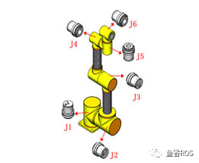
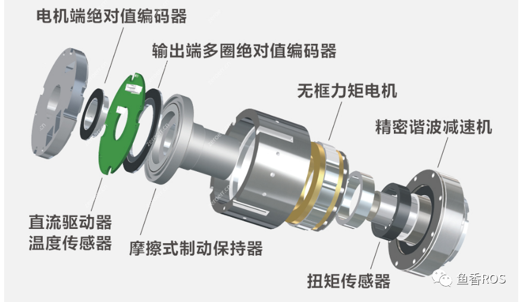

你可能不知道，你平时用的微波炉、冰箱等家电其实是机器人生产的。目前世界上运用最广的机器人其实并不是轮式的，而是工业机器人，也就是你常听说的机械臂。

因为机械臂可以像人的手一样到达空间中的各种姿态，并且可以实现很高（亚毫米）的精度，因此其应用非常的广泛。

机械臂一般是由多个关节（像人手一样）组成的，每个关节里面其实就是一个个电机。如图1-1所示，这是一个常见的六轴机械臂，关节虽小，五脏俱全，图1-2是关节的组成结构。

图1-1

图1-2

一般机械臂的关节都会提供位置控制、力控制或速度控制接口给我们使用，拿图1-1的六轴机械臂来说，假如我们可以改变每一个关节的角度，那么就可以让机械臂的末端到达各种姿态。

但随之而来的问题就来了，如何让机械臂末端以我们想要的速度、想要的轨迹到达我们想要的位置，有问题就有解决方案，基于ROS2的机械臂运动规划、感知、运动学、控制和导航的Moveit2就被设计出来解决这一类问题。

Moveit2的前身是Moveit,Moveit2继承了Moveit的优点结合ROS2带来的新特性，实现了一个更加强大的机械臂控制框架，所以从本章开始，我将带你一起学习和使用Moveit，并带你将自己的机械臂模型适配Moveit2。