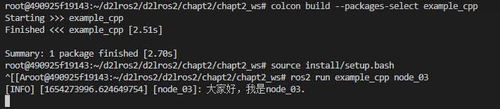
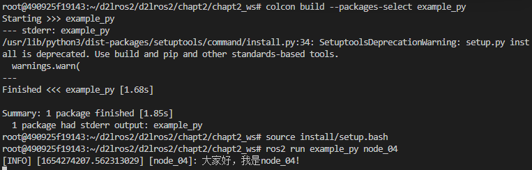

# 2.使用面向对象方式编写ROS2节点

## 1.C++版本

在`d2lros2/chapt2/chapt2_ws/src/example_cpp/src`下新建`node_03.cpp`，接着输入下面的代码。

```c++

#include "rclcpp/rclcpp.hpp"

/*
    创建一个类节点，名字叫做Node03,继承自Node.
*/
class Node03 : public rclcpp::Node
{

public:
    // 构造函数,有一个参数为节点名称
    Node03(std::string name) : Node(name)
    {
        // 打印一句
        RCLCPP_INFO(this->get_logger(), "大家好，我是%s.",name.c_str());
    }

private:
   
};

int main(int argc, char **argv)
{
    rclcpp::init(argc, argv);
    /*产生一个node_03的节点*/
    auto node = std::make_shared<Node03>("node_03");
    /* 运行节点，并检测退出信号*/
    rclcpp::spin(node);
    rclcpp::shutdown();
    return 0;
}
```

接着修改`CMakeLists.txt`，添加下方代码。

```
add_executable(node_03 src/node_03.cpp)
ament_target_dependencies(node_03 rclcpp)

install(TARGETS
  node_03
  DESTINATION lib/${PROJECT_NAME}
)
```

接着即可自行编译测试

```shell
colcon build --packages-select example_cpp
source install/setup.bash
ros2 run example_cpp node_03
```



## 2.Python版本

在`d2lros2/d2lros2/chapt2/chapt2_ws/src/example_py/example_py`下新建`node_04.py`，输入下面的代码

```python
#!/usr/bin/env python3
import rclpy
from rclpy.node import Node


class Node04(Node):
    """
    创建一个Node04节点，并在初始化时输出一个话
    """
    def __init__(self,name):
        super().__init__(name)
        self.get_logger().info("大家好，我是%s!" % name)


def main(args=None):
    rclpy.init(args=args) # 初始化rclpy
    node = Node04("node_04")  # 新建一个节点
    rclpy.spin(node) # 保持节点运行，检测是否收到退出指令（Ctrl+C）
    rclpy.shutdown() # 关闭rclpy

```

接着修改`setup.py`

```python
    entry_points={
        'console_scripts': [
            "node_02 = example_py.node_02:main",
            "node_04 = example_py.node_04:main"
        ],
    },
```

> 注意格式和结尾的`,`符号，`console_scripts`是个数组。

编译测试

```shell
colcon build --packages-select example_py
source install/setup.bash
ros2 run example_py node_04
```



## 3.总结

把节点写成一个类的形式对我们组织代码和使用ROS2的新特性有很多的好处，后面我们将以此种方式（用类建立节点）来学习后续内容。