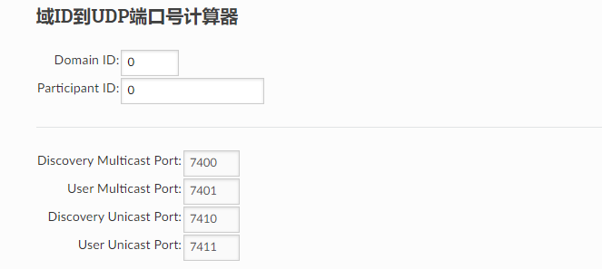

##  4.ROS2节点发现与多机通信

本文主要讲解ROS2的DOMAIN_ID概念，并介绍在没有ROSMASTER的情况下，ROS2如何实现互相发现。

## 1.概述

如其他地方所解释的，ROS 2用于通讯的默认中间件是DDS。在DDS中，不同逻辑网络共享物理网络的主要机制称为域(Domain) ID。同一域上的ROS 2节点可以自由地相互发现并发送消息，而不同域上的ROS 2节点则不能。所有ROS 2节点默认使用域ID为0。为了避免在同一网络上运行ROS 2的不同计算机组之间互相干扰，应为每组设置不同的域ID。

## 2.选择域ID (短版本)

下面的文本解释了应该在ROS 2中使用的域ID范围的推导。要跳过该背景知识并且只是选择一个安全的数字，只需选择一个介于0和101之间的安全的域ID (包括0和101)。

## 3.选择域ID (长版本)

DDS使用域ID计算将用于发现和通讯的UDP端口。有关如何计算端口的详细信息，请参见 这篇文章 。我们知道在网络中，UDP端口是 无符号16位整型 。因此可以分配的最大端口号是65535。用链接（http://dev.ros2.fishros.com/doc/Concepts/About-Domain-ID.html#domain-id-to-udp-port-calculator）中的公式计算一下，这意味着可以分配的最高域账号是232，而可以分配的最低域账号是0。

### 特定平台的约束

为了实现最大的兼容性，在选择域账号时应遵循一些特定于平台的附加约束。特别是，最好避免在操作系统的 临时端口范围 中分配域ID。这避免了ROS 2节点使用的端口与计算机上的其他网络服务之间可能的冲突。

以下是一些关于特定平台临时端口的提示。

**Linux**

默认情况下，linux内核使用端口32768-60999作为临时端口。这意味着域ID 0-101 和 215-232 可以安全使用，而不会与临时端口发生冲突。临时端口范围可在Linux中通过在 `/proc/sys/net/ipv4/ip_local_port_range` 中设置自定义值进行配置。如果使用自定义临时端口范围，则可能需要相应地调整上述数字。

**macOS**

默认情况下，macOS上的临时端口范围为49152-65535。这意味着域ID 0-166可以安全使用，而不会与临时端口发生冲突。通过为 `net.inet.ip.portrange.first` 和 `net.inet.ip.portrange.last` 设置自定义sysctl值，临时端口范围可在macOS中配置。如果使用自定义临时端口范围，则可能需要相应地调整上述数字。

**Windows**

默认情况下，Windows上的临时端口范围为49152-65535。这意味着域ID 0-166可以安全使用，不会与临时端口发生冲突。临时的端口范围可通过 使用netsh 在窗口中配置。如果使用自定义临时端口范围，则可能需要相应地调整上述数字。

### 参与者约束

对于计算机上运行的每个ROS 2进程，将创建一个DDS "participant" 。由于每个DDS参与者占用计算机上的两个端口，因此在一台计算机上运行120个以上的ROS 2进程可能会溢出到其他域ID或临时端口。

为了解释原因，我们考虑域ID编号1和2。

* 域ID 1使用端口7650和7651进行多播。
* 域ID 2使用端口7900和7901进行多播。
* 在域ID 1中创建第一个进程 (第0个参与者) 时，端口7660和7661用于单播。
* 在域ID 1中创建第120个进程 (第119个参与者) 时，端口7898和7899用于单播。
* 在域ID 1中创建第121个进程 (第120个参与者) 时，端口7900和7901用于单播，并与域ID 2重叠。

如果已知计算机一次只能在一个域ID上，并且域ID足够低，那么创建比这更多的ROS 2进程是安全的。

在选择特定平台域 ID 范围顶部的域 ID 时，还有一个限制因素需要考虑。

例如，假设一台ID为101的Linux计算机:

* 计算机上的第0个ROS 2进程将连接到端口32650、32651、32660和32661。
* 计算机上的第1个ROS 2进程将连接到端口32650、32651、32662和32663。
* 计算机上的第53个ROS 2进程将连接到端口32650、32651、32766和32767。
* 计算机上的第54个ROS 2进程将连接到端口32650、32651、32768和32769，运行在临时端口范围内。

因此，在Linux上使用域ID为101时应创建的最大进程数为54。同样，在Linux上使用域ID为232时应创建的最大进程数为63，因为最大端口号为65535。

macOS和Windows的情况相似，尽管数字不同。在macOS和Windows上，当选择166 (范围顶部) 的域账号时，运行到临时端口范围之前，可以在计算机上创建的ROS 2进程的最大数量为120。

## 4.域ID到UDP端口号计算器

> 到这里试用：
>
> http://dev.ros2.fishros.com/doc/Concepts/About-Domain-ID.html#domain-id-to-udp-port-calculator

--------------

技术交流&&问题求助：

- **微信公众号及交流群：鱼香ROS**
- **小鱼微信：AiIotRobot**
- **QQ交流群：139707339**

- 版权保护：已加入“维权骑士”（rightknights.com）的版权保护计划