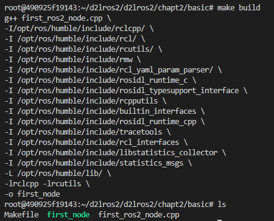
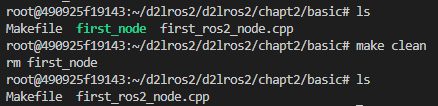
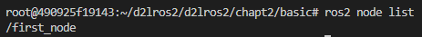

# 2.使用make编译ROS2节点

有没有觉得用g++编译节点无比的麻烦，的确是这样子，为此先行者们发明了一个叫做make的**批处理**工具，我们可以将g++的指令写成脚本，就可以通过make自动的调用脚本完成操作。

## 1.安装make

```shell
sudo apt install make
```

## 2.编写Makefile

在`d2lros2/d2lros2/chapt2/basic`下新建`Makefile`，然后将上面的g++编译指令用下面的形式写到Makefile里。

```makefile
build:
	g++ first_ros2_node.cpp \
	-I/opt/ros/humble/include/rclcpp/ \
	-I /opt/ros/humble/include/rcl/ \
	-I /opt/ros/humble/include/rcutils/ \
	-I /opt/ros/humble/include/rmw \
	-I /opt/ros/humble/include/rcl_yaml_param_parser/ \
	-I /opt/ros/humble/include/rosidl_runtime_c \
	-I /opt/ros/humble/include/rosidl_typesupport_interface \
	-I /opt/ros/humble/include/rcpputils \
	-I /opt/ros/humble/include/builtin_interfaces \
	-I /opt/ros/humble/include/rosidl_runtime_cpp \
	-I /opt/ros/humble/include/tracetools \
	-I /opt/ros/humble/include/rcl_interfaces \
	-I /opt/ros/humble/include/libstatistics_collector \
	-I /opt/ros/humble/include/statistics_msgs \
	-L /opt/ros/humble/lib/ \
	-lrclcpp -lrcutils \
	-o first_node
	
# 顺便小鱼加个clean指令，用来删掉first_node
clean:
	rm first_node
```

## 3. 编译

在Makefile同级目录输入

```
make build
```



可以看到make指令调用了脚本里的build下的指令，对代码进行了编译。同级目录下也产生了first_node可执行文件（绿色代表可执行）。

使用`make clean`指令即可删掉`first_node`节点。



## 4.运行测试

```
./first_node
```

新开终端

```
ros2 node list
```



