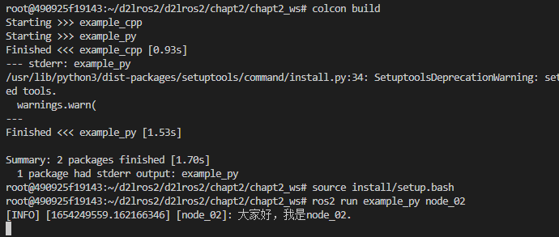
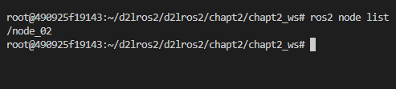

# 5.使用RCLPY编写节点

## 1.创建Python功能包

创建一个名字叫做`example_py` python版本的功能包。

```
cd chapt2/chapt2_ws/src/
ros2 pkg create example_py  --build-type ament_python --dependencies rclpy
```

创建完成后的目录结构

```
.
├── example_py
│   └── __init__.py
├── package.xml
├── resource
│   └── example_py
├── setup.cfg
├── setup.py
└── test
    ├── test_copyright.py
    ├── test_flake8.py
    └── test_pep257.py

3 directories, 8 files
```

## 2.编写程序

编写ROS2节点的一般步骤

```
1. 导入库文件
2. 初始化客户端库
3. 新建节点
4. spin循环节点
5. 关闭客户端库
```


在`example_py/example_py`下创建`node_02.py`接着我们开始编写代码。跟着小鱼一起边理解输入下面的代码，注释不用输。

```
import rclpy
from rclpy.node import Node

def main(args=None):
    """
    ros2运行该节点的入口函数
    编写ROS2节点的一般步骤
    1. 导入库文件
    2. 初始化客户端库
    3. 新建节点对象
    4. spin循环节点
    5. 关闭客户端库
    """
    rclpy.init(args=args) # 初始化rclpy
    node = Node("node_02")  # 新建一个节点
    node.get_logger().info("大家好，我是node_02.")
    rclpy.spin(node) # 保持节点运行，检测是否收到退出指令（Ctrl+C）
    rclpy.shutdown() # 关闭rclpy
```

代码编写完成用Crtl+S进行保存。接着修改`setup.py`。

```
    entry_points={
        'console_scripts': [
            "node_02 = example_py.node_02:main"
        ],
    },
)
```

`setup.py`这段配置是声明一个ROS2的节点，声明后使用`colcon build`才能检测到，从而将其添加到`install`目录下。

完成上面的工作后，就可以编译运行了。

## 3.编译运行节点

打开vscode终端，进入`chapt2/chapt2_ws/`

### 3.1 编译节点

```
cd chapt2/chapt2_ws/
colcon build
```

> ```
> --- stderr: example_py                   
> /usr/lib/python3/dist-packages/setuptools/command/install.py:34: SetuptoolsDeprecationWarning: setup.py install is deprecated. Use build and pip and other standards-based tools.
>   warnings.warn(
> ---
> ```
>
> 如果在编译中看到上述错误没关系，不影响使用，ros2官方正在修复。
> 错误原因是setuptools版本太高造成，使用下面的指令可以进行版本的回退。
> ```
> sudo pip install setuptools==58.2.0 --upgrade
> ```

### 3.2 source环境

```
source install/setup.bash
```

### 3.3 运行节点

```
ros2 run example_py node_02
```

运行结果



## 4.测试

当节点运行起来后，可以再尝试使用`ros2 node list `指令来查看现有的节点。这个时候你应该能看到：



这说明你的节点已经运行起来了。

## 5.总结

本节我们学习了使用Python在工作空间的功能包里编写一个节点，代码是相同的，但是多了一些配置。

当然除了使用这种方法编写一个节点，还有其他方式，小鱼将其放到了进阶篇来讲。

--------------

技术交流&&问题求助：

- **微信公众号及交流群：鱼香ROS**
- **小鱼微信：AiIotRobot**
- **QQ交流群：139707339**

- 版权保护：已加入“维权骑士”（rightknights.com）的版权保护计划
