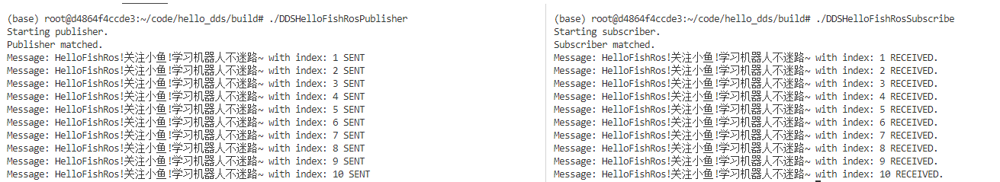

## 3.HelloFish例程

DDS使用的RTPS，就是Real-Time Publish Subscribe协议，其实和ROS与ROS2中的发布订阅的感觉时一样的，所以我们就跑一个例程来收发消息，消息内容就叫`HelloFish`

小鱼写的程序已经准备好了，放到了github上，大家可以直接下载下来编译测试哦~

### 下载代码

```
git clone https://github.com/fishros/dds_tutorial.git
```

### 编译例程

```
cd dds_tutorial/examples/01-hellofishros
mkdir build && cd build
cmake .. 
make
```

### 执行例程

开一个终端

```
./DDSHelloFishRosPublisher  
```

再开一个终端

```
./DDSHelloFishRosSubscribe
```

### 查看结果

正确结果像下面这样子，已经证明一切OK了~


## 4.总结

看到熟悉的发布订阅是不是很神奇，FASTDDS底层采用了多种协议进行数据的传输，包括不靠谱但真的很快的UDP，靠谱但是不怎么快的TCP，还有感觉不传输的内存交换（SHM)。

为了给大家展示一下什么叫做低产（懒），小鱼决定明天再给大家讲解代码~