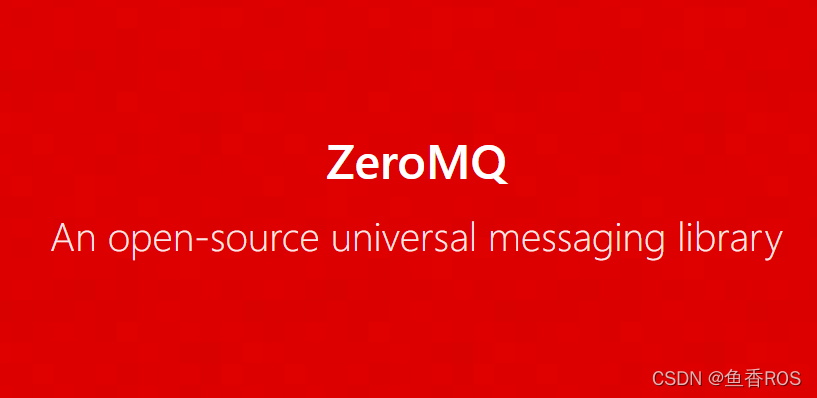

# 2.通信中间件之ZMQ

- [零MQ (zeromq.org)](https://zeromq.org/)

## 1.什么是ZeroMQ

在说pyzmq之前，肯定要了解一下ZeroMQ，小鱼了解ZeroMQ还是从FastDDS那里，因为FastDDS官网老是在哪里强调自己比ZeroMQ性能要好。

大家知道FastDDS是ROS2的通信中间件，那既然FastDDS比ZeroMQ性能好，那为啥小鱼还要介绍ZeroMQ呢？

原因是ZeroMQ非常的轻量，也就是小巧，占用资源少，看名字，Zero Message Queue，零消息队列。

ZeroMQ提供了各种（如进程内、进程间、TCP 和多播）消息传输的套接字，是不是听起来很强大的样子。

## 2.PyZmq

了解完ZMQ是啥后，我们再来看看PyZMQ。

因为文档过于完善，小鱼不打算跟大家费解释了，给一个官方网址，大家自行阅读

- https://pyzmq.readthedocs.io/en/latest/

pyzmq也提供了类似于订阅发布的方式来传递消息，还有更多的使用方法，比如客户端服务端这种，网上有大佬已经探索了，小鱼贴个链接在这里，大家有需要使用的可以去瞅一瞅。

- https://www.php.cn/python-tutorials-459626.html

## 3.总结

如果你在做机器人，需要去ROS，需要找一个高效的消息中间件，我想ZMQ应该比较适合你，当然也可以根据机器人的处理器和性能试试ROS2的FastDDS。