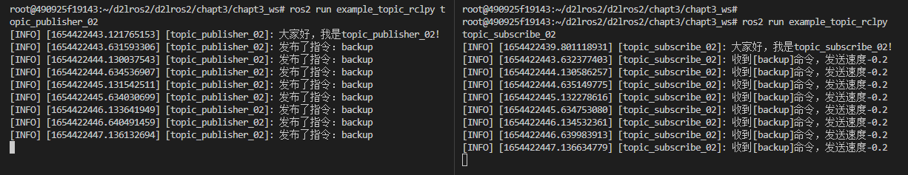

# 3.话题之RCLPY实现

有了前面的经验，实现Python版本的发布订阅也非常的轻松了，因为ROS2的API一致性保持的很好，这点值得点赞。

- [Node — rclpy 0.6.1 documentation (ros2.org)](https://docs.ros2.org/latest/api/rclpy/api/node.html)

## 1.创建功能包和节点

创建功能包

```
cd chapt3/chapt3_ws/src/
ros2 pkg create example_topic_rclpy  --build-type ament_python --dependencies rclpy
```

创建节点文件

```
cd example_topic_rclpy/example_topic_rclpy
touch topic_subscribe_02.py
touch topic_publisher_02.py
```

简单编写下代码，依然采用类的形式

发布者

```
#!/usr/bin/env python3
import rclpy
from rclpy.node import Node

class NodePublisher02(Node):
    def __init__(self,name):
        super().__init__(name)
        self.get_logger().info("大家好，我是%s!" % name)

def main(args=None):
    rclpy.init(args=args) # 初始化rclpy
    node = NodePublisher02("topic_publisher_02")  # 新建一个节点
    rclpy.spin(node) # 保持节点运行，检测是否收到退出指令（Ctrl+C）
    rclpy.shutdown() # 关闭rclpy
```

订阅节点

```
#!/usr/bin/env python3
import rclpy
from rclpy.node import Node

class NodeSubscribe02(Node):
    def __init__(self,name):
        super().__init__(name)
        self.get_logger().info("大家好，我是%s!" % name)

def main(args=None):
    rclpy.init(args=args) # 初始化rclpy
    node = NodeSubscribe02("topic_subscribe_02")  # 新建一个节点
    rclpy.spin(node) # 保持节点运行，检测是否收到退出指令（Ctrl+C）
    rclpy.shutdown() # 关闭rclpy
```

setup.py

```
    entry_points={
        'console_scripts': [
            "topic_publisher_02 = example_topic_rclpy.topic_publisher_02:main",
            "topic_subscribe_02 = example_topic_rclpy.topic_subscribe_02:main"
        ],
    },
```

## 2.编写订阅者

```
from std_msgs.msg import String


class NodeSubscribe02(Node):
    def __init__(self,name):
        super().__init__(name)
        self.get_logger().info("大家好，我是%s!" % name)
        # 创建订阅者
        self.command_subscribe_ = self.create_subscription(String,"command",self.command_callback,10)

    def command_callback(self,msg):
        speed = 0.0
        if msg.data=="backup":
            speed = -0.2
        self.get_logger().info(f'收到[{msg.data}]命令，发送速度{speed}')
```

## 3.编写发布者

```
from std_msgs.msg import String

class NodePublisher02(Node):
    def __init__(self,name):
        super().__init__(name)
        self.get_logger().info("大家好，我是%s!" % name)
        self.command_publisher_ = self.create_publisher(String,"command", 10) 
        self.timer = self.create_timer(0.5, self.timer_callback)
    
    def timer_callback(self):
        """
        定时器回调函数
        """
        msg = String()
        msg.data = 'backup'
        self.command_publisher_.publish(msg) 
        self.get_logger().info(f'发布了指令：{msg.data}')    #打印一下发布的数据
```

## 4.运行测试

### 4.1 发布节点

```
cd chapt3/chapt3_ws/
source install/setup.bash
ros2 run example_topic_rclpy topic_publisher_02
```

### 4.1 订阅节点

```
cd chapt3/chapt3_ws/
source install/setup.bash
ros2 run example_topic_rclpy topic_subscribe_02
```

### 

### 4.2 RQT


--------------

技术交流&&问题求助：

- **微信公众号及交流群：鱼香ROS**
- **小鱼微信：AiIotRobot**
- **QQ交流群：139707339**

- 版权保护：已加入“维权骑士”（rightknights.com）的版权保护计划