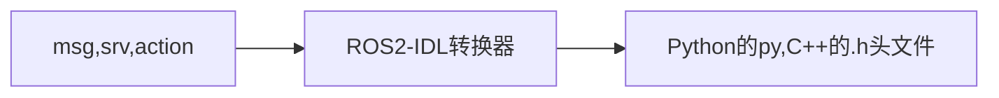
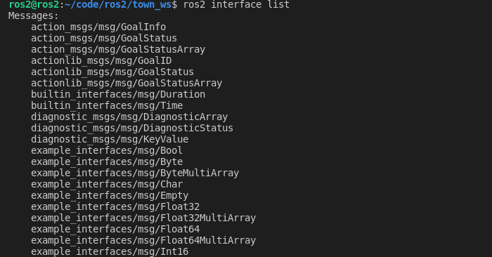

# 7.ROS2接口介绍

本节小鱼将会带你学习认识一个新的概念，叫做interface，即接口。

## 1.ROS2接口介绍

### 1.1 什么是接口

**接口其实是一种规范**

你还记得前面几节的示例中，我们在代码中使用过这两种接口，这两种数据类型分别代表字符串和32位二进制的整型数据，是ROS 2提前定义的一种规范。

```
std_msgs/msg/String
std_msgs/msg/UInt32
```

### 1.2 为什么使用接口

小鱼举一个雷达的例子，不同的厂家生产出不同的类型的激光雷达，每种雷达驱动方式、扫描速率等等都不相同。

当机器人进行导航时，需要激光雷达的扫描数据，假如没有统一接口，每次更换一个种类的雷达，都需要重新做程序适配。

于是ROS2中定义了一个统一的接口叫做`sensor_msgs/msg/LaserScan`,现在几乎每个雷达的厂家都会编写程序将自己雷达的数据变成`sensor_msgs/msg/LaserScan`格式，提供给用户使用。

如果雷达的例子不好理解，大家可以把雷达换成手机充电器，USB接口是不是也是一种规范，所有的厂家都按照这种接口进行充电器和连接线的生产。


### 1.3. ROS2自带的接口

前面话题通信时`std_msgs`功能包是我们安装ROS2的时候ROS2为我们自动安装的，除了`std_msgs`之外，`ROS2`还定义了很多做机器人常用的接口。

> 使用`ros2 interface package sensor_msgs`命令可以查看某一个接口包下所有的接口

比如：传感器类的消息包`sensor_msgs`

```
打开终端输入：ros2 interface package sensor_msgs
sensor_msgs/msg/JointState  #机器人关节数据
sensor_msgs/msg/Temperature #温度数据
sensor_msgs/msg/Imu #加速度传感器
sensor_msgs/msg/Image #图像
sensor_msgs/msg/LaserScan #雷达数据
......
```

虽然ROS2为我们定义了大量`有手就行，拿来就用`的接口，但有时候还是不能满足我们的变态想法，所以我们需要掌握自定义接口的方法。

## 2. 接口文件内容

### 2.1 可以定义的接口三种类型

小鱼提到过，ROS2提供了四种通信方式：

- 话题-Topics
- 服务-Services
- 动作-Action
- 参数-Parameters

除了参数之外，话题、服务和动作(Action)都支持自定义接口，每一种通信方式所适用的场景各不相同，所定义的接口也被分为话题接口、服务接口、动作接口三种。

### 2.2 接口形式

这三种接口定义起来有什么不一样的地方呢？小鱼先带大家直观感受一下：

话题接口格式：`xxx.msg`

```
int64 num
```

服务接口格式：`xxx.srv`

```
int64 a
int64 b
---
int64 sum
```

动作接口格式：`xxx.action`

```
int32 order
---
int32[] sequence
---
int32[] partial_sequence
```

### 2.3 接口数据类型

根据引用方式不同可以分为基础类型和包装类型两类。

基础类型有（同时后面加上[]可形成数组）

```
bool
byte
char
float32,float64
int8,uint8
int16,uint16
int32,uint32
int64,uint64
string
```

包装类型

即在已有的接口类型上进行包含，比如

```
uint32 id
string image_name
sensor_msgs/Image
```

### 2.4 接口如何生成代码

有的同学可能会问这样一个问题，我们只是简单的写了一下变量类型和名称，我们在程序里面怎么调用呢？

其实这里有一个转换的过程：将msg、srv、action文件转换为Python和C++的头文件。



通过ROS2的IDL模块 产生了头文件，有了头文件，我们就可以在程序里导入并使用这个消息模块。

## 3.自定义接口实践

### 3.1 场景定义

给定一个机器人开发中的常见控制场景，我们设计满足要求的服务接口和话题接口。

设计两个节点

- 一个机器人节点，对外提供移动指定距离服务，移动完成后返回当前位置，同时对外发布机器人的位置和状态（是否在移动）。
- 机器人控制节点，通过服务控制机器人移动指定距离，并实时获取机器人的当前位置和状态。

假设机器人在坐标轴上，只能前后移动。

### 3.2 定义接口

服务接口`MoveRobot.srv`

```
# 前进后退的距离
float32 distance
---
# 当前的位置
float32 pose
```

话题接口，采用基础类型  `RobotStatus.msg`

```
uint32 STATUS_MOVEING = 1
uint32 STATUS_STOP = 1
uint32  status
float32 pose
```

话题接口，混合包装类型 `RobotPose.msg`

```shell
uint32 STATUS_MOVEING = 1
uint32 STATUS_STOP = 2
uint32  status
geometry_msgs/Pose pose
```

### 3.3 创建接口功能包编接口

创建功能包

```shell
ros2 pkg create example_ros2_interfaces --build-type ament_cmake --dependencies rosidl_default_generators geometry_msgs
```

注意功能包类型必须为：ament_cmake

依赖`rosidl_default_generators`必须添加，`geometry_msgs`视内容情况添加（我们这里有`geometry_msgs/Pose pose`所以要添加）。

接着创建文件夹和文件将3.2中文件写入，注意话题接口放到`msg`文件夹下，以`.msg`结尾。服务接口放到`srv`文件夹下，以`srv`结尾。

```
.
├── CMakeLists.txt
├── msg
│   ├── RobotPose.msg
│   └── RobotStatus.msg
├── package.xml
└── srv
    └── MoveRobot.srv

2 directories, 5 files
```

接着修改`CMakeLists.txt`

```cmake
find_package(rosidl_default_generators REQUIRED)
find_package(geometry_msgs REQUIRED)
# 添加下面的内容
rosidl_generate_interfaces(${PROJECT_NAME}
  "msg/RobotPose.msg"
  "msg/RobotStatus.msg"
  "srv/MoveRobot.srv"
  DEPENDENCIES geometry_msgs
)
```

接着修改`package.xml`

```
  <buildtool_depend>ament_cmake</buildtool_depend>

  <depend>rosidl_default_generators</depend>
  <depend>geometry_msgs</depend>
  
  <member_of_group>rosidl_interface_packages</member_of_group> #添加这一行

  <test_depend>ament_lint_auto</test_depend>
  <test_depend>ament_lint_common</test_depend>
```

保存即可编译

```shell
colcon build --packages-select example_ros2_interfaces
```

编译完成后在`chapt3_ws/install/example_ros2_interfaces/include`下你应该可以看到C++的头文件。在`chapt3_ws/install/example_ros2_interfaces/local/lib/python3.10/dist-packages`下应该可以看到Python版本的头文件。

接下来的代码里我们就可以通过头文件导入和使用我们定义的接口了。

> @TODO 讲一下为什么要source

## 4.ROS2接口常用CLI命令

最后给大家讲一下ROS2接口相关的常用命令有哪些。

### 4.1查看接口列表

```
ros2 interface list
```




### 4.2 查看某一个接口详细的内容

```
ros2 interface show std_msgs/msg/String
```


