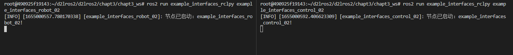
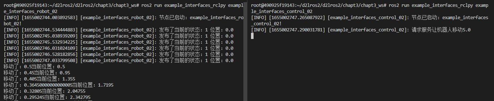
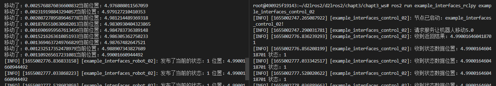

# 9.自定义接口RCLPY实战

上一节我们使用RCLCPP的API通过自定义接口实现控制节点和机器人节点之间的话题与服务通信。本节我们以RCLPY客户端库为例，给大家讲解实现方法。

## 1.创建功能包

这里我们依然设计两个节点

- `example_interfaces_robot_02`，机器人节点，对外提供控制机器人移动服务并发布机器人的状态。
- `example_interfaces_control_02`，控制节点，发送机器人移动请求，订阅机器人状态话题。

```sherll
cd chapt3_ws/
ros2 pkg create example_interfaces_rclpy --build-type ament_python --dependencies rclpy example_ros2_interfaces --destination-directory src --node-name example_interfaces_robot_02 --maintainer-name "fishros" --maintainer-email "fishros@foxmail.com"
touch src/example_interfaces_rclpy/example_interfaces_rclpy/example_interfaces_control_02.py
```

setup.py

```shell
maintainer='fishros',
maintainer_email='fishros@foxmail.com',
entry_points={
        'console_scripts': [
            'example_interfaces_control_02 = example_interfaces_rclpy.example_interfaces_control_02:main',
            'example_interfaces_robot_02 = example_interfaces_rclpy.example_interfaces_robot_02:main'
        ],
    },
```

> 这里小鱼又加了两个选项
>
> - `--maintainer-name "fishros"`，指定拥有者的名字
> - `--maintainer-email "fishros@foxmail.com"`，指定拥有者邮箱

example_interfaces_robot_02.py

```python
#!/usr/bin/env python3
import rclpy
from rclpy.node import Node

class Robot():
    def __init__(self) -> None:
		pass        

class ExampleInterfacesRobot02(Node):
    def __init__(self,name):
        super().__init__(name)
        self.get_logger().info("节点已启动：%s!" % name)
        
def main(args=None):
    rclpy.init(args=args) # 初始化rclpy
    node = ExampleInterfacesRobot02("example_interfaces_robot_02")  # 新建一个节点
    rclpy.spin(node) # 保持节点运行，检测是否收到退出指令（Ctrl+C）
    rclpy.shutdown() # 关闭rclpy
```

example_interfaces_control_02.py

```python
#!/usr/bin/env python3
import rclpy
from rclpy.node import Node

class ExampleInterfacesControl02(Node):
    def __init__(self,name):
        super().__init__(name)
        self.get_logger().info("节点已启动：%s!" % name)

def main(args=None):
    rclpy.init(args=args) # 初始化rclpy
    node = ExampleInterfacesControl02("example_interfaces_control_02")  # 新建一个节点
    rclpy.spin(node) # 保持节点运行，检测是否收到退出指令（Ctrl+C）
    rclpy.shutdown() # 关闭rclpy
```

编译测试

```
# 新终端
colcon build --packages-up-to example_interfaces_rclpy
source install/setup.bash
ros2 run example_interfaces_rclpy example_interfaces_robot_02
# 新终端
source install/setup.bash
ros2 run example_interfaces_rclpy example_interfaces_control_02
```



## 2.编写机器人类

源码与解析

```python
from example_ros2_interfaces.msg import RobotStatus
import math
from time import sleep

class Robot():
    def __init__(self) -> None:
        self.current_pose_ = 0.0
        self.target_pose_ = 0.0
        self.status_ = RobotStatus.STATUS_STOP

    def get_status(self):
        return self.status_

    def get_current_pose(self):
        return self.current_pose_

    def move_distance(self,distance):
        self.status_ = RobotStatus.STATUS_MOVEING # 更新状态为移动、
        self.target_pose_ += distance # 更新目标位置

        while math.fabs(self.target_pose_ - self.current_pose_) > 0.01:
            step = distance / math.fabs(distance) * math.fabs(self.target_pose_ - self.current_pose_) * 0.1 # 计算一步移动距离
            self.current_pose_  += step # 移动一步
            print(f"移动了：{step}当前位置：{self.current_pose_}")
            sleep(0.5) #休息0.5s
        self.status_ = RobotStatus.STATUS_STOP # 更新状态为停止
        return self.current_pose_
```

## 3.编写机器人节点

```python
from example_ros2_interfaces.srv import MoveRobot

class ExampleInterfacesRobot02(Node):
    def __init__(self,name):
        super().__init__(name)
        self.get_logger().info("节点已启动：%s!" % name)
        self.robot = Robot()
        self.move_robot_server_ = self.create_service(MoveRobot,"move_robot", self.handle_move_robot) 
        self.robot_status_publisher_ = self.create_publisher(RobotStatus,"robot_status", 10) 
        self.publisher_timer_ = self.create_timer(0.5, self.publisher_timer_callback)
    

    def publisher_timer_callback(self):
        """
        定时器回调发布数据函数
        """
        msg = RobotStatus() #构造消息
        msg.status = self.robot.get_status()
        msg.pose = self.robot.get_current_pose()
        self.robot_status_publisher_.publish(msg) # 发布消息
        self.get_logger().info(f'发布了当前的状态：{msg.status} 位置：{msg.pose}')

    def handle_move_robot(self,request, response):
        self.robot.move_distance(request.distance)
        response.pose = self.robot.get_current_pose()
        return response
```

逻辑与RCLCPP版本一致，创建服务和发布者，并创建定时器定时调用发布者完成发布。

## 4.编写控制节点

```python
#!/usr/bin/env python3
import rclpy
from rclpy.node import Node
from example_ros2_interfaces.msg import RobotStatus
from example_ros2_interfaces.srv import MoveRobot


class ExampleInterfacesControl02(Node):
    def __init__(self,name):
        super().__init__(name)
        self.get_logger().info("节点已启动：%s!" % name)
        self.client_ = self.create_client(MoveRobot,"move_robot") 
        self.robot_status_subscribe_ = self.create_subscription(RobotStatus,"robot_status",self.robot_status_callback,10)

    def robot_status_callback(self,msg):
        self.get_logger().info(f"收到状态数据位置：{msg.pose} 状态：{msg.status}")

    def move_result_callback_(self, result_future):
        response = result_future.result()
        self.get_logger().info(f"收到返回结果：{response.pose}")

    def move_robot(self, distance):
        while rclpy.ok() and self.client_.wait_for_service(1)==False:
            self.get_logger().info(f"等待服务端上线....")
        request = MoveRobot.Request()
        request.distance = distance
        self.get_logger().info(f"请求服务让机器人移动{distance}")
        self.client_.call_async(request).add_done_callback(self.move_result_callback_)


def main(args=None):
    rclpy.init(args=args) # 初始化rclpy
    node = ExampleInterfacesControl02("example_interfaces_control_02")  # 新建一个节点
    node.move_robot(5.0) #移动5米
    rclpy.spin(node) # 保持节点运行，检测是否收到退出指令（Ctrl+C）
    rclpy.shutdown() # 关闭rclpy
```

控制节点逻辑也与`RCLCPP`版本一致，创建一个订阅者和客户端，在主函数中请求服务端进行移动。

## 5.运行测试

```
# 新终端
colcon build --packages-up-to example_interfaces_rclpy
source install/setup.bash
ros2 run example_interfaces_rclpy example_interfaces_robot_02
# 新终端
source install/setup.bash
ros2 run example_interfaces_rclpy example_interfaces_control_02
```

同样的，你会发现在机器人移动期间是机器人节点并没有发布机器人位姿出来，在进阶篇中我们可以使用ROS2的多线程执行器和回调组来解决这个问题。




