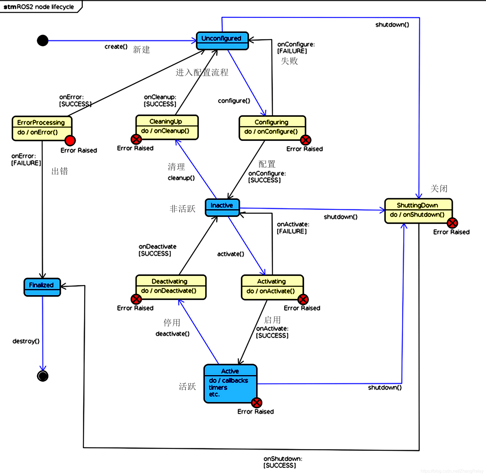

# 3. 生命周期节点

以前在ROS1中，节点的启动顺序无法被控制，这对整个机器人系统来说是一件非常危险和不可控的事，比如说机器人传感器还未启动就开始进行数据的读取了。

在ROS2中提出了生命周期节点的概念，通过生命周期来控制和检测节点状态。

本节小鱼就带你一起学习使用下ROS2的生命周期节点。

## 1.生命周期节点介绍

ROS2生命周期节点是利用状态机构成的，状态直接的转换依靠ROS2的通信机制完成。

生命周期节点主要有以下几个状态

- 未配置状态（Unconfigured） ，节点开始时的第一个状态，并在出现错误后结束。没有执行，其主要目的是错误恢复。
- 非活跃状态（Inactivate），节点持有资源（发布者、监听者等）和配置（参数、内部变量），但什么也不做。 没有执行，没有传输，传入的数据可以保存在缓冲区中，但不能读取， 主要目的是允许重新配置。
- 活跃状态（Activate），  正常执行。
- 已完成状态（Finalized），节点已被销毁。

具体的状态之间转换关系请参考下图。

<!-- ## 2.C++生命周期实例

## 3.Python生命周期实例

## 4.总结

 -->

参考文章

--------------

技术交流&&问题求助：

- **微信公众号及交流群：鱼香ROS**
- **小鱼微信：AiIotRobot**
- **QQ交流群：139707339**

- 版权保护：已加入“维权骑士”（rightknights.com）的版权保护计划