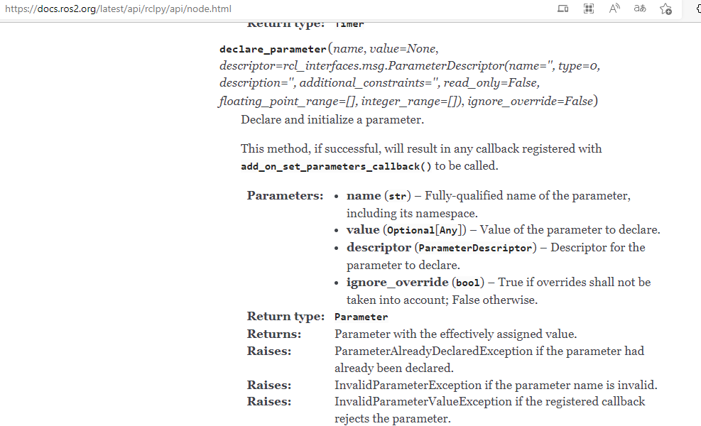
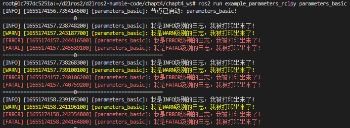
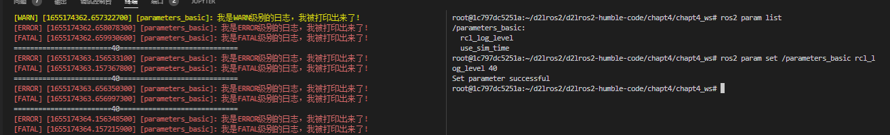

# 3.参数之RCLPY实现

上节利用RCLCPP的API实现了参数相关的基础操作（声明、获取），本节我们采用RCLPY的API来尝试实现相同的功能。

## 1.创建功能包和节点

```shell
cd chapt4/chapt4_ws/
ros2 pkg create example_parameters_rclpy --build-type ament_python --dependencies rclpy --destination-directory src --node-name parameters_basic --maintainer-name "fishros" --maintainer-email "fishros@foxmail.com"
```

parameters_basic.py

```python
#!/usr/bin/env python3
import rclpy
from rclpy.node import Node

class ParametersBasicNode(Node):
    """
    创建一个ParametersBasicNode节点，并在初始化时输出一个话
    """
    def __init__(self,name):
        super().__init__(name)
        self.get_logger().info(f"节点已启动：{name}!")

def main(args=None):
    rclpy.init(args=args) # 初始化rclpy
    node = ParametersBasicNode("parameters_basic")  # 新建一个节点
    rclpy.spin(node) # 保持节点运行，检测是否收到退出指令（Ctrl+C）
    rclpy.shutdown() # 关闭rclpy
```

## 2.RCLPY参数API

- https://docs.ros2.org/latest/api/rclpy/api/node.html



## 3.使用参数控制节点日志级别

```python
class ParametersBasicNode(Node):
    """
    创建一个ParametersBasicNode节点，并在初始化时输出一个话
    """

    def __init__(self, name):
        super().__init__(name)
        self.get_logger().info(f"节点已启动：{name}!")
        # 声明参数
        self.declare_parameter('rcl_log_level', 0)
        # 获取参数
        log_level = self.get_parameter("rcl_log_level").value
        # 设置参数
        self.get_logger().set_level(log_level)
        # 定时修改
        self.timer = self.create_timer(0.5, self.timer_callback)

    def timer_callback(self):
        """定时器回调函数"""
        # 获取参数
        log_level = self.get_parameter("rcl_log_level").value
        # 设置参数
        self.get_logger().set_level(log_level)
        print(
            f"========================{log_level}=============================")
        self.get_logger().debug("我是DEBUG级别的日志，我被打印出来了!")
        self.get_logger().info("我是INFO级别的日志，我被打印出来了!")
        self.get_logger().warn("我是WARN级别的日志，我被打印出来了!")
        self.get_logger().error("我是ERROR级别的日志，我被打印出来了!")
        self.get_logger().fatal("我是FATAL级别的日志，我被打印出来了!")


```

## 4.编译测试

```shell
colcon build  --packages-select example_parameters_rclpy
source install/setup.bash
ros2 run example_parameters_rclpy parameters_basic
```



指定参数值测试

```shell
ros2 run example_parameters_rclpy parameters_basic --ros-args -p rcl_log_level:=10
```

动态设置参数测试

```shell
ros2 param list
ros2 param set /parameters_basic rcl_log_level 40
```



## 5.总结

虽然实现了动态的设置参数，但还有些不够完美，参数的值被外界改变，我们的节点并没有收到任何通知，本节实现的动态改变是通过一个定时器不断的轮询获取参数值实现的，那有没有什么办法可以接收到参数改变的通知呢？答案在进阶篇。
