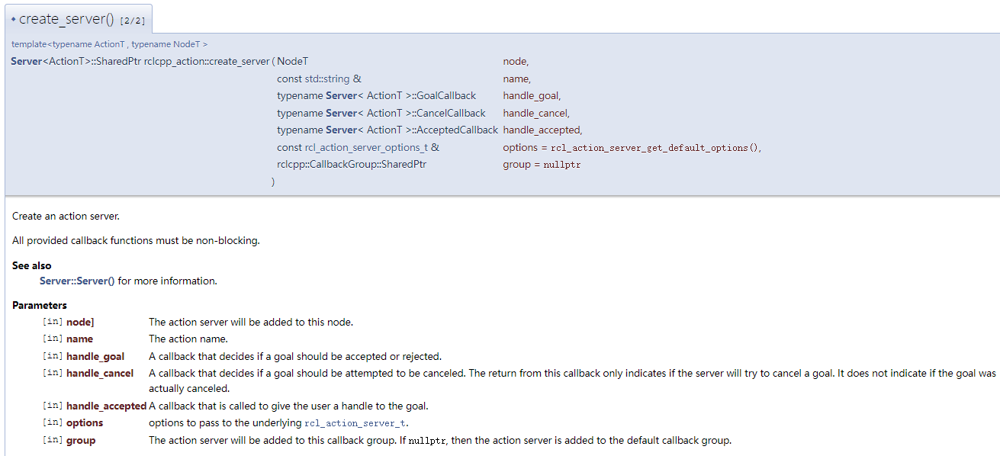
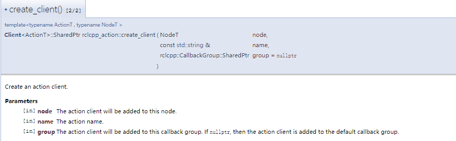
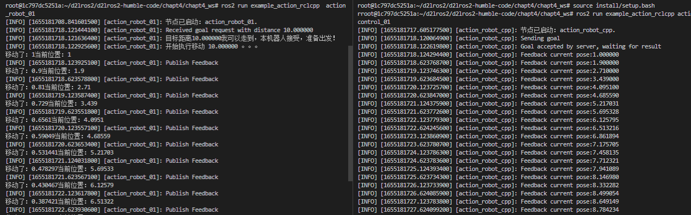
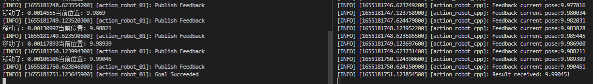

# 5.动作之CPP实现

上一节小鱼介绍了Action通信并一起自定义了一个接口，本节我们尝试使用接口来利用动作通信控制机器人。

## 1.创建功能包和节点

### 1.1 创建功能包

创建example_action_rclcpp功能包，添加`robot_control_interfaces`、`rclcpp_action`、`rclcpp`三个依赖，自动创建`action_robot_01`节点，并手动创建`action_control_01.cpp`节点。

```shell
cd chapt4_ws/
ros2 pkg create example_action_rclcpp --build-type ament_cmake --dependencies rclcpp rclcpp_action robot_control_interfaces --destination-directory src --node-name action_robot_01 --maintainer-name "fishros" --maintainer-email "fishros@foxmail.com"
touch src/example_action_rclcpp/src/action_control_01.cpp
```

接着我们创建Robot类的头文件和CPP文件。
```
touch src/example_action_rclcpp/include/example_action_rclcpp/robot.h
touch src/example_action_rclcpp/src/robot.cpp
```

创建完成后目录结构

```
.
├── CMakeLists.txt
├── include
│   └── example_action_rclcpp
│       └── robot.h 
├── package.xml
└── src
    ├── action_control_01.cpp
    ├── action_robot_01.cpp
    └── robot.cpp

3 directories, 6 files
```

### 1.2 robot.h

```cpp
/*
copyright
*/
#ifndef EXAMPLE_ACTIONI_RCLCPP_ROBOT_H_
#define EXAMPLE_ACTIONI_RCLCPP_ROBOT_H_
#include "rclcpp/rclcpp.hpp"
#include "robot_control_interfaces/action/move_robot.hpp"

class Robot {
 public:
  Robot() = default;
  ~Robot() = default;
 private:
};

#endif  // EXAMPLE_ACTIONI_RCLCPP_ROBOT_H_
```

### 1.3 robot.cpp

暂时为空，第二部分编写

```cpp
#include "example_action_rclcpp/robot.h"
```

### 1.4 action_robot_01.cpp

```cpp
#include "example_action_rclcpp/robot.h"
#include "rclcpp/rclcpp.hpp"
#include "rclcpp_action/rclcpp_action.hpp"
#include "robot_control_interfaces/action/move_robot.hpp"

// 创建一个ActionServer类
class ActionRobot01 : public rclcpp::Node {
 public:
  explicit ActionRobot01(std::string name) : Node(name) {
    RCLCPP_INFO(this->get_logger(), "节点已启动：%s.", name.c_str());
  }


};

int main(int argc, char** argv) {
  rclcpp::init(argc, argv);
  auto action_server = std::make_shared<ActionRobot01>("action_robot_01");
  rclcpp::spin(action_server);
  rclcpp::shutdown();
  return 0;
}
```

### 1.5 action_control_01.cpp

```cpp
#include "rclcpp/rclcpp.hpp"
#include "rclcpp_action/rclcpp_action.hpp"
#include "robot_control_interfaces/action/move_robot.hpp"

class ActionControl01 : public rclcpp::Node {
 public:
  explicit ActionControl01(std::string name): Node(name) {
    RCLCPP_INFO(this->get_logger(), "节点已启动：%s.", name.c_str());
  }


};  // class ActionControl01

int main(int argc, char** argv) {
  rclcpp::init(argc, argv);
  auto action_client = std::make_shared<ActionControl01>("action_robot_cpp");
  rclcpp::spin(action_client);
  rclcpp::shutdown();
  return 0;
}
```

### 1.6 CMakeList.txt

```cmake
find_package(ament_cmake REQUIRED)
find_package(rclcpp REQUIRED)
find_package(robot_control_interfaces REQUIRED)
find_package(example_interfaces REQUIRED)
find_package(rclcpp_action REQUIRED)

# action_robot节点

add_executable(action_robot_01 
    src/robot.cpp
    src/action_robot_01.cpp
)
target_include_directories(action_robot_01 PUBLIC
  $<BUILD_INTERFACE:${CMAKE_CURRENT_SOURCE_DIR}/include>
  $<INSTALL_INTERFACE:include>)
target_compile_features(action_robot_01 PUBLIC c_std_99 cxx_std_17)  # Require C99 and C++17
ament_target_dependencies(
  action_robot_01
  "rclcpp"
  "rclcpp_action"
  "robot_control_interfaces"
  "example_interfaces"
)

install(TARGETS action_robot_01
  DESTINATION lib/${PROJECT_NAME})

# action_control节点

add_executable(action_control_01 
  src/action_control_01.cpp
)
target_include_directories(action_control_01 PUBLIC
$<BUILD_INTERFACE:${CMAKE_CURRENT_SOURCE_DIR}/include>
$<INSTALL_INTERFACE:include>)
target_compile_features(action_control_01 PUBLIC c_std_99 cxx_std_17)  # Require C99 and C++17
ament_target_dependencies(
  action_control_01
  "rclcpp"
  "rclcpp_action"
  "robot_control_interfaces"
  "example_interfaces"
)

install(TARGETS action_control_01
DESTINATION lib/${PROJECT_NAME})

```

## 2.编写机器人类

机器人类主要负责移动机器人和提供当前机器人的状态，我们设计几个函数来实现该功能。

### 2.1 robot.h

```cpp
#ifndef EXAMPLE_ACTIONI_RCLCPP_ROBOT_H_
#define EXAMPLE_ACTIONI_RCLCPP_ROBOT_H_
#include "rclcpp/rclcpp.hpp"
#include "robot_control_interfaces/action/move_robot.hpp"

class Robot {
 public:
  using MoveRobot = robot_control_interfaces::action::MoveRobot;
  Robot() = default;
  ~Robot() = default;
  float move_step(); /*移动一小步，请间隔500ms调用一次*/
  bool set_goal(float distance); /*移动一段距离*/
  float get_current_pose();
  int get_status();
  bool close_goal(); /*是否接近目标*/
  void stop_move();  /*停止移动*/

 private:
  float current_pose_ = 0.0;             /*声明当前位置*/
  float target_pose_ = 0.0;              /*目标距离*/
  float move_distance_ = 0.0;            /*目标距离*/
  std::atomic<bool> cancel_flag_{false}; /*取消标志*/
  int status_ = MoveRobot::Feedback::STATUS_STOP;
};

#endif  // EXAMPLE_ACTIONI_RCLCPP_ROBOT_H_
```

### 2.2 robot.cpp

```cpp
#include "example_action_rclcpp/robot.h"

/*移动一小步，请间隔500ms调用一次*/
float Robot::move_step() {
  int direct = move_distance_ / fabs(move_distance_);
  float step = direct * fabs(target_pose_ - current_pose_) *
               0.1; /* 每一步移动当前到目标距离的1/10*/
  current_pose_ += step;
  std::cout << "移动了：" << step << "当前位置：" << current_pose_ << std::endl;
  return current_pose_;
}

/*移动一段距离*/
bool Robot::set_goal(float distance) {
  move_distance_ = distance;
  target_pose_ += move_distance_;

  /* 当目标距离和当前距离大于0.01同意向目标移动 */
  if (close_goal()) {
    status_ = MoveRobot::Feedback::STATUS_STOP;
    return false;
  }
  status_ = MoveRobot::Feedback::STATUS_MOVEING;
  return true;
}

float Robot::get_current_pose() { return current_pose_; }
int Robot::get_status() { return status_; }
/*是否接近目标*/
bool Robot::close_goal() { return fabs(target_pose_ - current_pose_) < 0.01; }
void Robot::stop_move() {
  status_ = MoveRobot::Feedback::STATUS_STOP;
} /*停止移动*/
```

## 3.编写机器人节点

```cpp
class ActionRobot01 : public rclcpp::Node {
 public:
  using MoveRobot = robot_control_interfaces::action::MoveRobot;
  using GoalHandleMoveRobot = rclcpp_action::ServerGoalHandle<MoveRobot>;

  explicit ActionRobot01(std::string name) : Node(name) {
    RCLCPP_INFO(this->get_logger(), "节点已启动：%s.", name.c_str());

    using namespace std::placeholders;  // NOLINT

    this->action_server_ = rclcpp_action::create_server<MoveRobot>(
        this, "move_robot",
        std::bind(&ActionRobot01::handle_goal, this, _1, _2),
        std::bind(&ActionRobot01::handle_cancel, this, _1),
        std::bind(&ActionRobot01::handle_accepted, this, _1));
  }

 private:
  Robot robot;
  rclcpp_action::Server<MoveRobot>::SharedPtr action_server_;

  rclcpp_action::GoalResponse handle_goal(
      const rclcpp_action::GoalUUID& uuid,
      std::shared_ptr<const MoveRobot::Goal> goal) {
    RCLCPP_INFO(this->get_logger(), "Received goal request with distance %f",
                goal->distance);
    (void)uuid;
    if (fabs(goal->distance > 100)) {
      RCLCPP_WARN(this->get_logger(), "目标距离太远了，本机器人表示拒绝！");
      return rclcpp_action::GoalResponse::REJECT;
    }
    RCLCPP_INFO(this->get_logger(),
                "目标距离%f我可以走到，本机器人接受，准备出发！",
                goal->distance);
    return rclcpp_action::GoalResponse::ACCEPT_AND_EXECUTE;
  }

  rclcpp_action::CancelResponse handle_cancel(
      const std::shared_ptr<GoalHandleMoveRobot> goal_handle) {
    RCLCPP_INFO(this->get_logger(), "Received request to cancel goal");
    (void)goal_handle;
    robot.stop_move(); /*认可取消执行，让机器人停下来*/
    return rclcpp_action::CancelResponse::ACCEPT;
  }

  void execute_move(const std::shared_ptr<GoalHandleMoveRobot> goal_handle) {
    const auto goal = goal_handle->get_goal();
    RCLCPP_INFO(this->get_logger(), "开始执行移动 %f 。。。", goal->distance);

    auto result = std::make_shared<MoveRobot::Result>();
    rclcpp::Rate rate = rclcpp::Rate(2);
    robot.set_goal(goal->distance);
    while (rclcpp::ok() && !robot.close_goal()) {
      robot.move_step();
      auto feedback = std::make_shared<MoveRobot::Feedback>();
      feedback->pose = robot.get_current_pose();
      feedback->status = robot.get_status();
      goal_handle->publish_feedback(feedback);
      /*检测任务是否被取消*/
      if (goal_handle->is_canceling()) {
        result->pose = robot.get_current_pose();
        goal_handle->canceled(result);
        RCLCPP_INFO(this->get_logger(), "Goal Canceled");
        return;
      }
      RCLCPP_INFO(this->get_logger(), "Publish Feedback"); /*Publish feedback*/
      rate.sleep();
    }

    result->pose = robot.get_current_pose();
    goal_handle->succeed(result);
    RCLCPP_INFO(this->get_logger(), "Goal Succeeded");
  }

  void handle_accepted(const std::shared_ptr<GoalHandleMoveRobot> goal_handle) {
    using std::placeholders::_1;
    std::thread{std::bind(&ActionRobot01::execute_move, this, _1), goal_handle}
        .detach();
  }
};

```

### 代码解析

上面的代码信息量有些大，但都是围绕着Action展开的，小鱼带你一步步分解。

首先找到创建Action的API：https://docs.ros2.org/latest/api/rclcpp_action/




Action使用了三个回调函数，分别用于处理收到目标、收到停止、确认接受执行。

- handle_goal，收到目标，反馈是否可以执行该目标，可以则返回`ACCEPT_AND_EXECUTE`,不可以则返回`REJECT`
- handle_cancel，收到取消运行请求，可以则返回`ACCEPT`，不可以返回`REJECT`。
- handle_accepted，处理接受请求，当handle_goal中对移动请求`ACCEPT`后则进入到这里进行执行，这里我们是单独开了个线程进行执行`execute_move`函数，目的是避免阻塞主线程。

执行函数`execute_move`，调用机器人，进行一步步的移动，这里我们采用了while循环的形式，不断调用机器人移动并获取机器人的位置，通过feedback进行反馈。同时检测任务是否被取消，如顺利执行完成则反馈最终结果。

代码中我们还用到了Rate函数来精准控制循环的周期，让其保持为2HZ，关于Rate等流程控制的工具，小鱼放到进阶篇来讲解。

## 4.编写控制节点

先看API：[rclcpp_action: rclcpp_action Namespace Reference (ros2.org)](https://docs.ros2.org/latest/api/rclcpp_action/namespacerclcpp__action.html#a464f73efea313d6adb57cbbe5f487f18)



接着看代码

```cpp
class ActionControl01 : public rclcpp::Node {
 public:
  using MoveRobot = robot_control_interfaces::action::MoveRobot;
  using GoalHandleMoveRobot = rclcpp_action::ClientGoalHandle<MoveRobot>;

  explicit ActionControl01(
      std::string name,
      const rclcpp::NodeOptions& node_options = rclcpp::NodeOptions())
      : Node(name, node_options) {
    RCLCPP_INFO(this->get_logger(), "节点已启动：%s.", name.c_str());

    this->client_ptr_ =
        rclcpp_action::create_client<MoveRobot>(this, "move_robot");

    this->timer_ =
        this->create_wall_timer(std::chrono::milliseconds(500),
                                std::bind(&ActionControl01::send_goal, this));
  }

  void send_goal() {
    using namespace std::placeholders;

    this->timer_->cancel();

    if (!this->client_ptr_->wait_for_action_server(std::chrono::seconds(10))) {
      RCLCPP_ERROR(this->get_logger(),
                   "Action server not available after waiting");
      rclcpp::shutdown();
      return;
    }

    auto goal_msg = MoveRobot::Goal();
    goal_msg.distance = 10;

    RCLCPP_INFO(this->get_logger(), "Sending goal");

    auto send_goal_options =
        rclcpp_action::Client<MoveRobot>::SendGoalOptions();
    send_goal_options.goal_response_callback =
        std::bind(&ActionControl01::goal_response_callback, this, _1);
    send_goal_options.feedback_callback =
        std::bind(&ActionControl01::feedback_callback, this, _1, _2);
    send_goal_options.result_callback =
        std::bind(&ActionControl01::result_callback, this, _1);
    this->client_ptr_->async_send_goal(goal_msg, send_goal_options);
  }

 private:
  rclcpp_action::Client<MoveRobot>::SharedPtr client_ptr_;
  rclcpp::TimerBase::SharedPtr timer_;

  void goal_response_callback(GoalHandleMoveRobot::SharedPtr goal_handle) {
    if (!goal_handle) {
      RCLCPP_ERROR(this->get_logger(), "Goal was rejected by server");
    } else {
      RCLCPP_INFO(this->get_logger(),
                  "Goal accepted by server, waiting for result");
    }
  }

  void feedback_callback(
      GoalHandleMoveRobot::SharedPtr,
      const std::shared_ptr<const MoveRobot::Feedback> feedback) {
    RCLCPP_INFO(this->get_logger(), "Feedback current pose:%f", feedback->pose);
  }

  void result_callback(const GoalHandleMoveRobot::WrappedResult& result) {
    switch (result.code) {
      case rclcpp_action::ResultCode::SUCCEEDED:
        break;
      case rclcpp_action::ResultCode::ABORTED:
        RCLCPP_ERROR(this->get_logger(), "Goal was aborted");
        return;
      case rclcpp_action::ResultCode::CANCELED:
        RCLCPP_ERROR(this->get_logger(), "Goal was canceled");
        return;
      default:
        RCLCPP_ERROR(this->get_logger(), "Unknown result code");
        return;
    }

    RCLCPP_INFO(this->get_logger(), "Result received: %f", result.result->pose);
    // rclcpp::shutdown();
  }
};  // class ActionControl01

```

代码解析

创建客户端简单，发送请求的时候可以指定三个回调函数：

- goal_response_callback，目标的响应回调函数。
- feedback_callback，执行过程中进度反馈接收回调函数。
- result_callback，最终结果接收的回调函数。

这里利用了定时器完成了定时请求的功能，请求一次后就立马使用`timer_->cancel();`取消掉了这个定时器，如此就实现了节点启动后定时发一次请求的功能。

## 5.编译测试

一个终端，运行机器人节点

```
cd chapt4_ws/
colcon build --packages-up-to example_action_rclcpp
source install/setup.bash 
ros2 run example_action_rclcpp  action_robot_01
```

新终端，运行控制节点

```
source install/setup.bash 
ros2 run example_action_rclcpp action_control_01
```



执行完成




## 6.总结与测试

上面只做了简单的测试，你可以尝试再编写一个定时器，在节点启动的第5s时发送取消执行请求，看看是否可以让机器人停下来。

本节我们利用rclcpp_action的API实现了Action通信的测试，Action在后续的机器人开发中并没那么常用，但是其思想比较重要，应该掌握。

