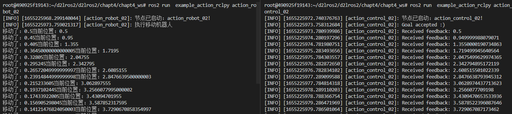

# 6.动作之RCLPY实现

上节我们再C++中结合RCLCPP和RCLCPPACTION库实现了Action通信，本节我们利用RCLPY在Python中实现相同的功能。

## 1.创建功能包和节点

### 1.1 创建功能包

```shell
cd chapt4_ws/
ros2 pkg create example_action_rclpy --build-type ament_python --dependencies rclpy robot_control_interfaces --destination-directory src --node-name action_robot_02 --maintainer-name "fishros" --maintainer-email "fishros@foxmail.com"
# 手动再创建action_control_02节点文件
touch src/example_action_rclpy/example_action_rclpy/action_control_02.py
#手动创建机器人类robot.py
touch src/example_action_rclpy/example_action_rclpy/robot.py
```

### 1.2 robot.py

```
from robot_control_interfaces.action import MoveRobot
import math

class Robot():
    """机器人类，模拟一个机器人"""

    def __init__(self) -> None:
        pass

    def get_status(self):
        """获取状态"""
        pass

    def get_current_pose(self):
        """获取当前位置"""
        pass

    def close_goal(self):
        """接近目标"""
        pass

    def stop_move(self):
        """停止移动"""
        pass

    def move_step(self):
        """移动一小步"""
        pass

    def set_goal(self, distance):
        """设置目标"""
        pass
```

### 1.3 action_robot_02.py

```shell
#!/usr/bin/env python3

import time
# 导入rclpy相关库
import rclpy
from rclpy.node import Node
from rclpy.action import ActionServer
from rclpy.action.server import ServerGoalHandle
# 导入接口
from robot_control_interfaces.action import MoveRobot
# 导入机器人类
from example_action_rclpy.robot import Robot
#from rclpy.executors import MultiThreadedExecutor
#from rclpy.callback_groups import MutuallyExclusiveCallbackGroup

class ActionRobot02(Node):
    """机器人端Action服务"""

    def __init__(self,name):
        super().__init__(name)
        self.get_logger().info(f"节点已启动：{name}!")
        
def main(args=None):
    """主函数"""
    rclpy.init(args=args)
    action_robot_02 = ActionRobot02("action_robot_02")
    # 采用多线程执行器解决rate死锁问题
    # executor = MultiThreadedExecutor()
    # executor.add_node(action_robot_02)
    # executor.spin()
    rclpy.spin(action_robot_02)
    rclpy.shutdown()
```

### 1.4 action_control_02.py

```python
import rclpy
from rclpy.action import ActionClient
from rclpy.node import Node
# 导入Action接口
from robot_control_interfaces.action import MoveRobot

class ActionControl02(Node):
    """Action客户端"""

    def __init__(self,name):
        super().__init__(name)
		self.get_logger().info(f"节点已启动：{name}!")

def main(args=None):
    """主函数"""
    rclpy.init(args=args)
    action_robot_02 = ActionControl02("action_control_02")
    rclpy.spin(action_robot_02)
    rclpy.shutdown()
```

### 1.5 setup.py

```python
    entry_points={
        'console_scripts': [
            'action_robot_02 = example_action_rclpy.action_robot_02:main',
            'action_control_02 = example_action_rclpy.action_control_02:main'
        ],
    },
```

接着就可以自行编译测试是否可以将节点运行起来了

## 2.编写机器人类

```python
class Robot():
    """机器人类，模拟一个机器人"""

    def __init__(self) -> None:
        self.current_pose_ = 0.0
        self.target_pose_ = 0.0
        self.move_distance_ = 0.0
        self.status_ = MoveRobot.Feedback

    def get_status(self):
        """获取状态"""
        return self.status_

    def get_current_pose(self):
        """获取当前位置"""
        return self.current_pose_

    def close_goal(self):
        """接近目标"""
        return math.fabs(self.target_pose_ - self.current_pose_) < 0.01

    def stop_move(self):
        """停止移动"""
        self.status_ = MoveRobot.Feedback.STATUS_STOP

    def move_step(self):
        """移动一小步"""
        direct = self.move_distance_ / math.fabs(self.move_distance_)
        step = direct * math.fabs(self.target_pose_ - self.current_pose_) * 0.1
        self.current_pose_ += step  # 移动一步
        print(f"移动了：{step}当前位置：{self.current_pose_}")
        return self.current_pose_

    def set_goal(self, distance):
        """设置目标"""
        self.move_distance_ = distance
        self.target_pose_ += distance  # 更新目标位置

        if self.close_goal():
            self.stop_move()
            return False

        self.status_ = MoveRobot.Feedback.STATUS_MOVEING  # 更新状态为移动
        return True

```

代码不复杂，就不进行解析了

## 3.编写机器人节点

```python
class ActionRobot02(Node):
    """机器人端Action服务"""

    def __init__(self,name):
        super().__init__(name)
        self.get_logger().info(f"节点已启动：{name}!")

        self.robot_ = Robot()

        self.action_server_ = ActionServer(
            self, MoveRobot, 'move_robot', self.execute_callback
            # ,callback_group=MutuallyExclusiveCallbackGroup()
        )

    def execute_callback(self, goal_handle: ServerGoalHandle):
        """执行回调函数,若采用默认handle_goal函数则会自动调用"""
        self.get_logger().info('执行移动机器人')
        feedback_msg = MoveRobot.Feedback()
        self.robot_.set_goal(goal_handle.request.distance)

        # rate = self.create_rate(2)
        while rclpy.ok() and not self.robot_.close_goal():
            # move
            self.robot_.move_step()
            # feedback
            feedback_msg.pose = self.robot_.get_current_pose()
            feedback_msg.status = self.robot_.get_status()
            goal_handle.publish_feedback(feedback_msg)
            # cancel check
            if goal_handle.is_cancel_requested:
                result = MoveRobot.Result()
                result.pose = self.robot_.get_current_pose()
                return result
            # rate.sleep() # Rate会造成死锁，单线程执行器时不能使用
            time.sleep(0.5)

        goal_handle.succeed()
        result = MoveRobot.Result()
        result.pose = self.robot_.get_current_pose()
        return result
```

真是人生苦短，我用Python，这里代码就变得简单了

只指定了一个回调函数` self.execute_callback`，原因在于Python这为我们封装好了几个默认的函数。

打开文件`/opt/ros/humble/local/lib/python3.10/dist-packages/rclpy/action/server.py`，查看源码如下

```python
class ActionServer(Waitable):
    """ROS Action server."""

    def __init__(
        self,
        node,
        action_type,
        action_name,
        execute_callback,
        *,
        callback_group=None,
        goal_callback=default_goal_callback,
        handle_accepted_callback=default_handle_accepted_callback,
        cancel_callback=default_cancel_callback,
        goal_service_qos_profile=qos_profile_services_default,
        result_service_qos_profile=qos_profile_services_default,
        cancel_service_qos_profile=qos_profile_services_default,
        feedback_pub_qos_profile=QoSProfile(depth=10),
        status_pub_qos_profile=qos_profile_action_status_default,
        result_timeout=900
    ):
        """
        Create an ActionServer.

        :param node: The ROS node to add the action server to.
        :param action_type: Type of the action.
        :param action_name: Name of the action.
            Used as part of the underlying topic and service names.
        :param execute_callback: Callback function for processing accepted goals.
            This is called if when :class:`ServerGoalHandle.execute()` is called for
            a goal handle that is being tracked by this action server.
        :param callback_group: Callback group to add the action server to.
            If None, then the node's default callback group is used.
        :param goal_callback: Callback function for handling new goal requests.
        :param handle_accepted_callback: Callback function for handling newly accepted goals.
            Passes an instance of `ServerGoalHandle` as an argument.
        :param cancel_callback: Callback function for handling cancel requests.
        :param goal_service_qos_profile: QoS profile for the goal service.
        :param result_service_qos_profile: QoS profile for the result service.
        :param cancel_service_qos_profile: QoS profile for the cancel service.
        :param feedback_pub_qos_profile: QoS profile for the feedback publisher.
        :param status_pub_qos_profile: QoS profile for the status publisher.
        :param result_timeout: How long in seconds a result is kept by the server after a goal
            reaches a terminal state.
        """
```

刚刚说的的几个默认函数

```python
def default_handle_accepted_callback(goal_handle):
    """Execute the goal."""
    goal_handle.execute()


def default_goal_callback(goal_request):
    """Accept all goals."""
    return GoalResponse.ACCEPT


def default_cancel_callback(cancel_request):
    """No cancellations."""
    return CancelResponse.REJECT

```


## 4.编写控制节点

```python
class ActionControl02(Node):
    """Action客户端"""

    def __init__(self, name):
        super().__init__(name)
        self.get_logger().info(f"节点已启动：{name}!")
        self.action_client_ = ActionClient(self, MoveRobot, 'move_robot')
        self.send_goal_timer_ = self.create_timer(1, self.send_goal)

    def send_goal(self):
        """发送目标"""
        self.send_goal_timer_.cancel()
        goal_msg = MoveRobot.Goal()
        goal_msg.distance = 5.0
        self.action_client_.wait_for_server()
        self._send_goal_future = self.action_client_.send_goal_async(goal_msg,
                                                                     feedback_callback=self.feedback_callback)
        self._send_goal_future.add_done_callback(self.goal_response_callback)

    def goal_response_callback(self, future):
        """收到目标处理结果"""
        goal_handle = future.result()
        if not goal_handle.accepted:
            self.get_logger().info('Goal rejected :(')
            return
        self.get_logger().info('Goal accepted :)')
        self._get_result_future = goal_handle.get_result_async()
        self._get_result_future.add_done_callback(self.get_result_callback)

    def get_result_callback(self, future):
        """获取结果反馈"""
        result = future.result().result
        self.get_logger().info(f'Result: {result.pose}')

    def feedback_callback(self, feedback_msg):
        """获取回调反馈"""
        feedback = feedback_msg.feedback
        self.get_logger().info(f'Received feedback: {feedback.pose}')
```

控制节点依然采用三个回调函数实现数据的接收

- goal_response_callback，收到目标处理结果。
- get_result_callback，获取结果反馈。
- feedback_callback，接收过程信息。

## 5.构建测试

接着我们可以编译进行测试。

```
cd chapt4_ws/
colcon build --packages-up-to example_action_rclpy
# 运行机器人节点
source install/setup.bash 
ros2 run example_action_rclpy  action_robot_02
# 新终端
source install/setup.bash 
ros2 run example_action_rclpy  action_control_02
```



## 6.总结

本节我们学习了使用Python编写Action，在设计上Python显得比C++更好用些，但背后的逻辑都是一样的，下一节我们将对ROS2节点通信进行总结。
