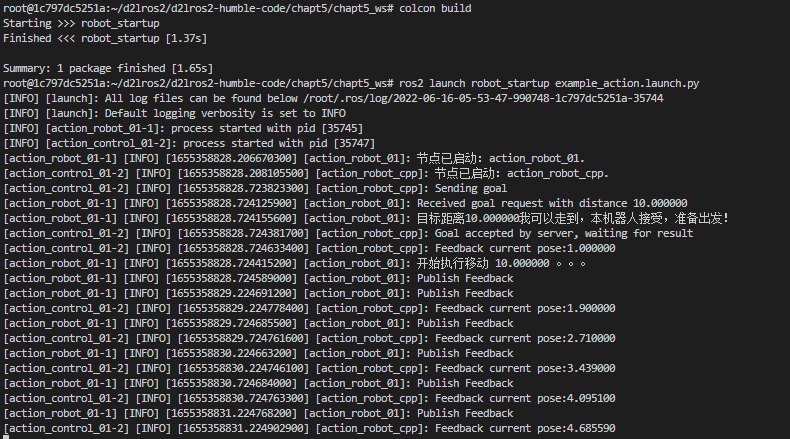

# 1.启动管理工具-Launch

大家好，我是小鱼。今天我们来讲一讲机器人启动系统之Launch。

## 1.Launch启动工具介绍

### 1.1 问题描述

对于一个机器人系统来说，往往由很多个不同功能的节点组成，启动一个机器人系统时往往需要启动多个节点，同时根据应用场景和机器人的不同，每个节点还会有不同的配置项。

如果每个节点我们都开一个新终端，敲`ros2 run`指令并写一堆参数，这是多么浪费生命且令人绝望的事情。

除了启动，你会发现，一个个关闭也是很难受的。

### 1.2 解决方案

可不可以编写一个类似于脚本的文件来管理节点的启动呢？

ROS2设计时就为我们想好了，为我们设计了一套完整的语法和规则的文件来帮助我们组织节点的启动，这个武器就叫launch文件。

**launch文件允许我们同时启动和配置多个包含 ROS 2 节点的可执行文件**

> 在ROS1中launch文件只有一种格式以.launch结尾的xml文档，不熟悉的同学写起来被xml语法折磨的死去活来。不过在ROS2中不要担心，因为在ROS2你可以使用Python代码来编写launch文件


## 2.编写第一个ROS2的launch文件

### 2.1 三种编写launch文件的方法

ROS2的launch文件有三种格式，python、xml、yaml。其中ROS2官方推荐的时python方式编写launch文件。
原因在于，相较于XML和YAML，**Python是一个编程语言，更加的灵活，我们可以利用Python的很多库来做一些其他工作**（比如创建一些初始化的目录等）。

> 除了灵活还有另外一个原因是ros2/launch（一般launch共功能）和ros2/launch_ros（ROS 2 launch的特性）是用 Python 编写的，我们使用python编写launch文件可以使用 XML 和 YAML 中不能用的launch功能。
> 要说使用python版本的launch有什么坏处，那就是写起来比yaml要冗余

### 2.2 使用Python编写Launch

我们的目标是编写一个launch文件，最后使用launch指令，同时启动服务端和客户端节点。

#### 2.2.1 创建功能包和launch文件

创建文件夹和功能包，接着touch一个launch文件，后缀为`.py`。

```
mkdir -p chapt5/chapt5_ws/src
cd chapt5/chapt5_ws/src
ros2 pkg create robot_startup --build-type ament_cmake --destination-directory src
mkdir -p src/robot_startup/launch
touch src/robot_startup/launch/example_action.launch.py
```

#### 2.2.2 启动多个节点的示例

我们需要导入两个库，一个叫做LaunchDescription，用于对launch文件内容进行描述，一个是Node，用于声明节点所在的位置。

> 注意这里要定一个名字叫做`generate_launch_description`的函数，ROS2会对该函数名字做识别。

```python
# 导入库
from launch import LaunchDescription
from launch_ros.actions import Node

def generate_launch_description():
    """launch内容描述函数，由ros2 launch 扫描调用"""
    action_robot_01 = Node(
        package="example_action_rclcpp",
        executable="action_robot_01"
    )
    action_control_01 = Node(
        package="example_action_rclcpp",
        executable="action_control_01"
    )
    # 创建LaunchDescription对象launch_description,用于描述launch文件
    launch_description = LaunchDescription(
        [action_robot_01, action_control_01])
    # 返回让ROS2根据launch描述执行节点
    return launch_description

```

#### 2.2.3 将launch文件拷贝到安装目录

如果你编写完成后直接编译你会发现install目录下根本没有你编写的launch文件，后续launch自然也找不到这个launch文件。

因为我们用的是`ament_cmake`类型功能包，所以这里要使用cmake命令进行文件的拷贝

```cmake
install(DIRECTORY launch
  DESTINATION share/${PROJECT_NAME})
```

如果是`ament_python`功能包版

```python
from setuptools import setup
from glob import glob
import os

setup(
    name=package_name,
    version='0.0.0',
    packages=[package_name],
    data_files=[
        ('share/ament_index/resource_index/packages',
            ['resource/' + package_name]),
        ('share/' + package_name, ['package.xml']),
        (os.path.join('share', package_name, 'launch'), glob('launch/*.launch.py')),
    ],
    },
)

```

#### 2.2.4 编译测试

使用colcon指令编译我们的程序

```python
colcon build
```

编译完成后，在`chapt5/chapt5_ws/install/robot_startup/share/robot_startup/launch`目录下你应该就可以看到被cmake拷贝过去的launch文件了。

接着运行`

```sheel
# source 第五章的工作目录，这样才能找到对应的节点，不信你可以不source试试
source ../../chapt5/chapt5_ws/install/setup.bash
source install/setup.bash
ros2 launch robot_startup example_action.launch.py
# 新终端
ros2 node list #即可看到两个节点
```



## 3 添加参数&修改命名空间

接着我们尝试使用launch运行参数节点，并通过launch传递参数，和给节点以不同的命名空间。

新建`chapt5/chapt5_ws/src/robot_startup/launch/example_param_rclcpp.launch.py`。

编写内容如下

```python
# 导入库
from launch import LaunchDescription
from launch_ros.actions import Node

def generate_launch_description():
    """launch内容描述函数，由ros2 launch 扫描调用"""
    parameters_basic1 = Node(
        package="example_parameters_rclcpp",
        namespace="rclcpp",
        executable="parameters_basic",
        parameters=[{'rcl_log_level': 40}]
    )
    parameters_basic2 = Node(
        package="example_parameters_rclpy",
        namespace="rclpy",
        executable="parameters_basic",
        parameters=[{'rcl_log_level': 50}]
    )
    # 创建LaunchDescription对象launch_description,用于描述launch文件
    launch_description = LaunchDescription(
        [parameters_basic1, parameters_basic2])
    # 返回让ROS2根据launch描述执行节点
    return launch_description
```

编译运行测试

```shell
# source 第五章的工作目录，这样才能找到对应的节点，不信你可以不source试试
source ../../chapt5/chapt5_ws/install/setup.bash
source install/setup.bash
ros2 launch robot_startup example_param_rclcpp.launch.py
# 新终端
ros2 node list #即可看到两个节点
```


## 4. 总结

今天只是简单讲了下，使用launch文件来同时启动多个节点，对节点的一些参数也可以在launch中配置。

launch还有很多更深入的用法，范子琦同学总结的很不错，这里放个链接：

- http://www.robotsfan.com/posts/7a5950c4.html


--------------

技术交流&&问题求助：

- **微信公众号及交流群：鱼香ROS**
- **小鱼微信：AiIotRobot**
- **QQ交流群：139707339**

- 版权保护：已加入“维权骑士”（rightknights.com）的版权保护计划
