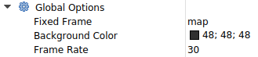

# 3. RVIZ2

本节我们来说一说，机器人开发中常用的数据可视化工具RVIZ2。

## 1.RVIZ2是什么

RVIZ2是ROS2中的一个非常重要且常用的数据可视化工具。

那数据指的是什么数据？可视化又是怎么可视化的？RVIZ2又是如何实现不同数据的可视化的呢？

答案如下：

- 数据：各种调试机器人时常用的数据，比如：图像数据、三维点云数据、地图数据、TF数据，机器人模型数据等等
- 可视化：可视化就是让你直观的看到数据，比如说一个三维的点(100,100,100),通过RVIZ可以将其显示在空间中
- 如何做到不同数据的可视化：强大的插件，如果没有你的数据，你可以自己再写一个插件，即插即用，方便快捷

> 注意：RVIZ强调将数据可视化出来，是已有数据的情况下，把数据显示出来而以，而我们后面要讲的gazebo仿真软件是通过模拟真实环境产生数据，两者用途并不一样。

## 2.RVIZ2 基础配置

### 2.1 全局配置

- Fixed Frame：所有帧参考的帧的名称，坐标都是相对的，这个就是告诉RVIZ你是相对谁的，一般是设置成map或者odom
- Frame Rate：用于设置更新 3D 视图的最大频率。

### 2.2 网格

用于可视化通常与地板平面相关联的网格

- Reference frame：帧用作网格坐标参考（通常：<fixed_frame>）
- Plane cell count: 单元格中网格的大小
- Normal cell count：在沿垂直于叶栅平面的网格数（正常：0）
- Cell size：每个网格单元的尺寸（以米为单位）
- Plane：标识网格平面的两个轴

### 2.3 机器人模型

根据 URDF 模型的描述来可视化机器人的模型。

- Visual enabled: 启用/禁用模型的 3D 可视化
- Description Source：机器人模型文件的来源，可以在File和Topic之间进行选择
- Description Topic: 机器人模型文件所在的话题

### 2.4 TF

可视化构成 TF 广播的所有帧的位置和方向

- Marker Scale: 将字和坐标系标识调整的小一些，使其更加可见且不那么混乱
- Update interval：以秒为单位的TF广播更新时间

最佳实践，勾选你想看的Frames，直观的看到两个坐标之间的关系

## 3.总结

看完之后是不是还挺不明所以的，因为大多插件都是和坐标相关的，这个要大家学习了下一章节机器人学和URDF建模之后就非常的清晰了

--------------

技术交流&&问题求助：

- **微信公众号及交流群：鱼香ROS**
- **小鱼微信：AiIotRobot**
- **QQ交流群：139707339**

- 版权保护：已加入“维权骑士”（rightknights.com）的版权保护计划
