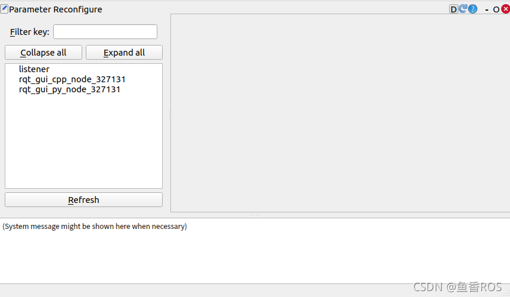

# 4. RQT工具

大家好，我是小鱼，今天来说说ROS2的RQT工具。

前面小鱼介绍过rqt_graph这个工具，我们在平时编写ROS2程序中经常使用，除了rqt_graph,ROS2中还有很多非常易用的RQT工具，一起来体验下

## 1. RQT是什么

RQT是一个GUI框架，通过插件的方式实现了各种各样的界面工具。

强行解读下：RQT就像插座，任何电器只要符合插座的型号就可以插上去工作。

> 说到这里你应该对ROS2的插件化设计感到无比震撼，上节的bag话题录制的存储格式也是插件式的。

## 2. 体验RQT

没有复杂的指令，一句命令行就可以调出rqt界面。

```bash
rqt
```

打开之后的窗口如下图，空空如也，不要担心，因为我们没有选插件的原因。


### 2.1 选择插件

这里我们可以选择现有的几个RQT插件来试一试，可以看到和话题、参数、服务、动作四大通信组件相关的工具都有，还有一些可视化、日志和系统计算图等相关的。


我们按照比较常用的几个来看一下，其他的大家有个印象，后续用到再用。

### 2.2 插件大观

#### Introspection / Node Graph

第一个是肯定是rqt_graph,插件名字叫做Node Graph,这个名字小鱼觉得更加的贴切，用rqt_graph更多的是为了延续ROS1中的用法，这个**插件用于查看节点和节点之间的关系的**。


#### Introspection / Process Monitor

这个插件可以看到所有与ROS2相关的进程


#### Topic/ Message Publisher

可以图形化发布话题数据


#### Service /Service Caller

图形化调用服务工具


#### Visualization / Image View

看图像话题数据的Image View


#### Visualization / MatPlot

话题数据图形化工具MqtPlot，小鱼就是用这个工具来调PID的


#### Configuration / Parameter Reconfigure



## 3. 总结

小鱼准备有时间开发一些RQT工具来满足平时的一些特殊场景的使用，到时写一个教程出来，下一节我们一起学习ROS2中的RVIZ2工具。


--------------

技术交流&&问题求助：

- **微信公众号及交流群：鱼香ROS**
- **小鱼微信：AiIotRobot**
- **QQ交流群：139707339**

- 版权保护：已加入“维权骑士”（rightknights.com）的版权保护计划
