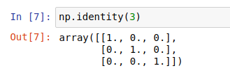
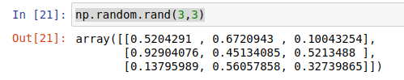

# 3.矩阵运算实战

上一节我们安装好了MiniConda和Jupyter，本节课我们继续回到学习机器人学的路上来。首先我们来学习使用一个矩阵库Numpy，并且通过Numpy将我们第一节学习到的矩阵相关计算一一实现。

## 1.NumPy是什么

`NumPy`是一个功能强大的`Python`库，主要用于对多维数组执行计算。NumPy这个词来源于两个单词-- `Numerical`和`Python`。NumPy提供了大量的库函数和操作，可以帮助程序员轻松地进行数值计算。

通过这个库我们可以非常简单的完成矩阵的创建、矩阵的计算，不管是二维还是多维都非常的`easy`.

NumPy可以使用在以下场景：

- **机器学习模型：** 在编写机器学习算法时，需要对矩阵进行各种数值计算。例如矩阵乘法、换位、加法等。NumPy提供了一个非常好的库，用于简单(在编写代码方面)和快速(在速度方面)计算。NumPy数组可用于存储训练数据和机器学习模型的参数。

- **图像处理和计算机图形学：** 计算机中的图像表示为多维数字数组。NumPy成为同样情况下最自然的选择。实际上，NumPy提供了一些优秀的库函数来快速处理图像。例如，镜像图像、按特定角度旋转图像等。

- **数学任务：** NumPy对于执行各种数学任务非常有用，如数值积分、微分、内插、外推等。因此，当涉及到数学任务时，它形成了一种基于Python的对MATLAB的快速替代。

## 2.Numpy安装

我们尝试在单元格内导入numpy，如果报错说明你没有安装

```bash
import numpy as np
```


在conda环境中安装非常的简单，也是一句话的事，在单元格内输入下面的代码，然后`Shift+Enter`执行即可。

> 注意指令前面有一个!，感叹号代表我们输入的是一句命令行

```bash
!pip install numpy  -i https://pypi.tuna.tsinghua.edu.cn/simple
```


安装完成后，再次导入就不会报错了。

## 3.创建矩阵

导入完成之后我们就可以通过numpy来创建矩阵。

> numpy中有矩阵和数组两个概念，数组相比矩阵更加灵活

### 3.1 创建单位矩阵

创建一个3*3的零矩阵。

```bash
np.identity(3)
```



### 3.2 创建零矩阵

创建一个3*3的零矩阵。

```python
np.zeros([3,3])
```


### 3.3 创建随机矩阵

创建一个3*3的随机矩阵。

```python
np.random.rand(3,3)
```



### 3.4 从已有数组创建矩阵

假设我们已经有了数据，我们想创建一个矩阵怎么办呢？

比如我们创建一个2*2的矩阵，矩阵的数据分别是[1,2,3,4]。

> 我们可以通过reshape改变矩阵的形状，这里我们把矩阵变成了2*2的样子。

```python
np.asarray([1,2,3,4]).reshape(2,2)
```


### 3.5 判断两个矩阵是否相等

numpy的allclose方法，比较两个array是不是每一元素都相等，默认在1e-05的误差范围内。

我们做一个测试：

```python
print("零矩阵和单位矩阵",np.allclose(np.zeros([3,3]),np.identity(3)))
print("单位矩阵和单位矩阵",np.allclose(np.identity(3),np.identity(3)))
```


## 4.计算矩阵

计算矩阵我们主要对第一节中的矩阵算法进行验证。

### 4.1 矩阵加法/减法

加法使用`np.add`,减法`np.subtract`


```python
A = np.asarray([1,2,3,4]).reshape(2,2)
B = np.zeros(2)
print(np.add(A,B))
```


### 4.2 矩阵乘法

乘法使用`np.dot`

**（前提同形）任何矩阵乘上零矩阵等于零矩阵，任何矩阵乘上单位矩阵等于其本身**

```python
A = np.asarray([1,2,3,4]).reshape(2,2)
B = np.zeros([2,2])
C = np.identity(2)
print(np.dot(A,B))
print(np.dot(A,C))
```


### 4.3 矩阵求逆

矩阵求逆使用`np.linalg.inv`

**矩阵的逆与矩阵的乘积为单位矩阵**

```python
A = np.asarray([1,2,3,4]).reshape(2,2)
A_INV = np.linalg.inv(A)
print(A_INV)
print(np.dot(A,A_INV))
```


**需要注意的是，并不是所有的矩阵都有逆，比如零矩阵就没有逆，如果尝试用`numpy`来求逆则会出现错误**

```python
O = np.zeros(2)
O_INV = np.linalg.inv(O)
```


**另外如果使用的是`conda`提供的`numpy`包，对于某些不存在逆的矩阵，并不会抛出错误。**
**但是对于通过`pip`安装的相同版本甚至更高版本的`numpy`，则不会出现类似问题。**

```python
""" 
numpy packages isntalled from conda:
numpy                     1.21.2           py38h20f2e39_0
numpy-base                1.21.2           py38h79a1101_0
"""
c=np.asarray([
    1,2,3,
    4,5,6,
    7,8,9,
]).reshape((3,3))

print("矩阵的行列式：",np.linalg.det(c))
print("矩阵的秩：",np.linalg.matrix_rank(c))
c_inv=np.linalg.inv(c)
print("矩阵c和c_inv点乘的结果：","\n",np.dot(c,c_inv))
```


### 4.4 矩阵转置

矩阵转置在矩阵后使用`.T`即可

```python
A = np.asarray([1,2,3,4]).reshape(2,2)
A.T
```


## 5.总结

今天一起学习了使用numpy操作矩阵，还有更多的资料可以在公众号后台回复numpy获取，我们下节见～

--------------

技术交流&&问题求助：

- **微信公众号及交流群：鱼香ROS**
- **小鱼微信：AiIotRobot**
- **QQ交流群：139707339**

- 版权保护：已加入“维权骑士”（rightknights.com）的版权保护计划