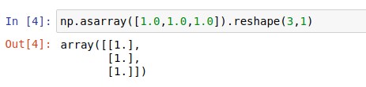

# 2.空间坐标描述实战

大家好，我是小鱼，上一节我们学习了坐标描述和坐标变换的理论知识，本节课我们把重点放到动手实现上，通过numpy实现坐标的描述和变换，同时结合ROS2鱼RVIZ进行坐标关系可视化与求解。

通过本节你将掌握：

- 使用numpy表示位置矢量和旋转矩阵
- 使用numpy进行平移与旋转坐标变换
- 了解ROS2中TF2的概念
- 使用tf2相关CLI工具进行坐标变换
- 使用python操作TF进行坐标变换

## 1.numpy表示位姿

在前几节中，小鱼带你安装使用了ROS2和MiniConda，并学习使用Numpy进行矩阵相关运算的验证。

那我们如何使用numpy中的矩阵表示位置矢量和旋转矩阵呢？

### 1.1 位置表示

上一节中我们使用一个3行1列的矩阵表示了位置，那么我们在numpy中自然也可以使用这样一个矩阵表示。

打开终端，输入下面指令打开jupyter

```shell
jupyter-notebook
```

新建一个python3的代码并重命名，接着在单元格中导入numpy

```
import numpy as np
```


#### 1.1.1 位置矩阵

使用3*1的矩阵表示位置，我们新建一个沿着x、y、z各平移1个单位的位置矢量。

```
np.asarray([1.0,1.0,1.0]).reshape(3,1)
```



### 1.2 姿态表示

姿态可以使用`3*3`的旋转矩阵表示,`3*3`的单位矩阵代表没有姿态变换，注意没有姿态变换不是零矩阵，而是单位矩阵。

我们新建一个旋转矩阵，用该旋转矩阵表示绕着z轴旋转45度，可以这样写：

```
import math
import numpy as np
theta = math.radians(45)
R_AB = np.asarray([math.cos(theta),-math.sin(theta),0,
                   math.sin(theta),math.cos(theta),0,
                   0,0,1
                  ]).reshape(3,3)
print(R_AB)
```

运行后得到的旋转矩阵是不是和上节的一样


## 2.numpy坐标变换

掌握了使用numpy表示位置和姿态后，接着我们使用numpy来完成上一节的小练习

### 2.1 题目

#### 如图🔓示，已知：


1.相机坐标系{C}为参考坐标系，工具坐标系{P}的位置矢量在相机坐标系{C}的`x,y,z`各轴投影为$2,1,2$，并且工具坐标系和相机坐标系姿态相同。

2.机器人基坐标系{B}为参考坐标系，相机坐标系{C}的位置矢量在{B}各轴的投影为$0,0,3$，坐标系{C}绕着坐标系{B}的x轴转了180度

可以参考下图看题目


#### 求：

**{B}为参考坐标系，坐标系{P}的位置矢量和旋转矩阵**

### 2.2 使用numpy求解

#### 2.2.1 旋转矩阵求解

这里我们就需要使用复合坐标变换了，根据坐标变换规则有：
$$
^B_PR=^B_CR^C_PR
$$
{C}和{P}姿态相同，所以$^C_PR$是一个单位矩阵。又因为{C}绕着{B}的x旋转了180度，根据上节的重要公式2可知
$$
R(x,\theta)= \begin{bmatrix} 
1 & 0           &          0\\
0 & {cos\theta} & -sin\theta \\
0&{sin\theta} & cos\theta \\

\end{bmatrix} \tag{小鱼提示：重要方程2}
$$
所以$^B_CR$对应的程序可以这样写

```python
import math
import numpy as np
theta = math.radians(180)
R_BC = np.asarray([1,0,0,
                   0,math.cos(theta),-math.sin(theta),
                   0,math.sin(theta),math.cos(theta)]).reshape(3,3)
```

所以$^B_PR$可以用程序求得：

```
R_BP = R_BC*np.identity(3)
print("旋转矩阵R_BP：\n",R_BP)
```


#### 2.2.2 平移矩阵求解

根据复合变换规则可知：
$$
^B_PP=^B_CR^C_PP+^B_CP
$$
根据描述有：$^B_CP=[0,0,3]^T$、$^C_PP=[2,1,2]^T$

所以可以写这样写程序：

```python
P_BC = np.asarray([0,0,3]).reshape(3,1)
P_CP = np.asarray([2,1,2]).reshape(3,1)
P_BP = np.add(np.dot(R_BC,P_CP),P_BC)
print("位置矢量P_BP:\n",P_BP.T)
```

运行下，可以得到结果


### 2.3 结果对比

与上节课答案一致

位置矢量：$[2,-1,1]^T$

旋转矩阵：
$$\begin{bmatrix} 
1 & 0 & 0\\
0 & -1 & 0\\
0 &0 & -1\\
\end{bmatrix} \tag{小鱼提示：重要方程1}$$


以上大家跟着小鱼一起学习了使用numpy表示位置和姿态，并使用了numpy来进行坐标变换，接下来我们直接使用ROS2中的TF工具不写一行代码进行坐标发布，同时我们还可以使用RVIZ2直观的查看坐标关系。

