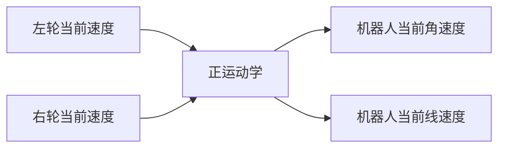
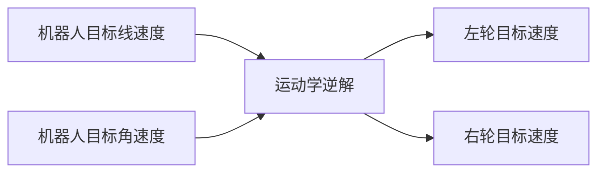

# 7. 机器人运动学介绍

机器人学是一个非常庞大的学科，凡是和机器人设计应用相关的都可以划分到机器人学中，主要有运动学和动力学、系统结构、感知传感技术、运动规划技术、决策技术等。

为了方便后面的机器人建模和仿真，本节我们对机器人的运动学进行简单的介绍和学习。

## 1.机器人运动学

机器人运动学研究机器人的位姿关系，主要包含正向运动学和逆向运动学两类。

正向运动学即给定机器人各关节变量，计算机器人末端的位置姿态；比如上节课我们已知机器人关节和关节之间的关系，求关节1和关节3之间的关系

逆向运动学即已知机器人末端的位置姿态，反求机器人的关节变量；比如当我们已知机器人关节1和关节3之间的关系，求关节关节1和关节2，关节2和关节3之间关系。

## 2.机械臂运动学介绍

正运动学：已知每个关节的角度，求末端的位姿

逆运动学：已知末端姿态，求每一个关节的角度

## 3.两轮差速底盘运动学介绍

两轮差速模型指机器人底盘由两个驱动轮和若干支撑轮构成的底盘模型，像turtlebot和开源机器人fishbot都是两轮差速模型。

两轮差速模型通过两个驱动轮可以通过不同转速和转向，使得机器人的达到某个特定的角速度和线速度。

两轮的平衡车大家都见过吧，靠着两个轮子即可实现前后移动（线速度），左转右转（角速度）。

### 3.1 正逆解

了解了两轮差速模型，那正逆解又是怎么回事？

正运动学：已知两个轮子的速度，求整车的角速度（弧度/秒）和线速度（米/秒）

逆运动学：已知目标角速度和线速度，求两个轮子的转速

### 3.2轮式里程计

当我们知道了两个轮子之间的相对位置，同时知道了每一时刻机器人的角速度和线速度，那我们如何获取机器人的当前角度和位置呢？

#### 3.2.1 角度

影响机器人当前角度的因素只有一个，就是角速度。

某一时刻机器人转动的角度 = 这一时刻机器人的角速度*这一时刻时长

假如我们认定初始时刻机器人的角度为0,通过对机器人转动角度角度进行累加，即可获得机器人的当前角度。

**上述过程其实就是对角速度进行积分得到角度。**

#### 3.2.2 位置

通过对角速度积分，我们得到了角度。

机器人某一时刻自身方向上的前进速度可以分解为里程计坐标系中x轴和y轴方向上的速度。

从图中可以看出：
$$
v_y = v*cos(\theta) \\
v_y = v*sin(\theta)
$$
得到了x和y方向上的速度，乘上该速度对应的某一时刻经过的时间，即可得到这一时刻在x轴和y轴方向上的位移，对位移进行累加即可得到里程计中的x和y。

--------------

技术交流&&问题求助：

- **微信公众号及交流群：鱼香ROS**
- **小鱼微信：AiIotRobot**
- **QQ交流群：139707339**

- 版权保护：已加入“维权骑士”（rightknights.com）的版权保护计划

