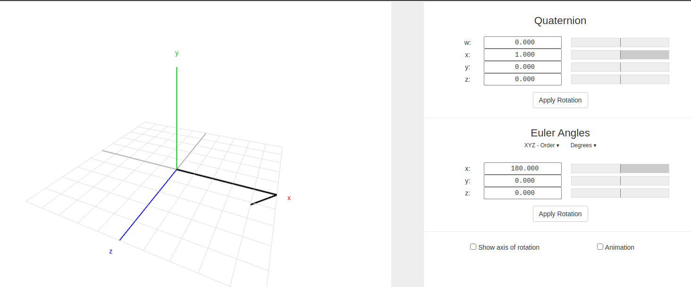

# 3.坐标变换发布监听Python实现

运行前面安装的jupyter，我们尝试使用代码来操作tf

在开始之前，我们总结下TF相关的操作有哪些？

- 广播（TransformBroadcaster）：将坐标系鱼坐标系之间的位姿态关系发布出去
- 监听（TransformListener）：获取坐标系和坐标系之间的位姿关系
- TF(坐标变换TransformStamped)帧：广播出去的一组数据可以称作一个TF帧，包含父坐标系名称、子坐标系名称，父坐标系和子坐标系之间的关系

接着我们就可以编写代码来实现上面对TF帧的发布和监听。

## 1.坐标变换广播

在进行坐标变换广播前，我们根据两个坐标系之间的关系是否会随着时间变化分成以下两种情况：

1. 坐标系之间的关系不随时间推移而改变，称为静态坐标变换，需要使用静态广播发布器（StaticTransformBroadcaster）发布。比如：机器人的两个轮子之间关系，可以认为随时间的变换其相对位置不变。
2. 坐标系之间的关系随时间的推移而改变，称为（动态）坐标变换，使用广播发布器（TransformBroadcaster）发布坐标关系。比如机器人在世界坐标系中的位置，因为机器人会动。

我们依然使用手眼系统为例，尝试使用广播发布器来发布坐标系之间的关系。
在手眼系统中，机械臂基座和相机坐标系之间的位置是固定不变的，我们可以通过静态广播发布器来发布，而相机坐标系下工件的位置是实时识别得到的，其值会随时间变化，故我们用广播发布器来发布。

## 2.静态广播发布器

在jupyter中输入并运行以下程序，使用方式就像ros2的话题发布，只不过不需要指名发布的话题（发布到系统的TF树上）。

<!-- > 原程序地址：[tf2_static_tf_publish.ipynb](https://fishros.com/d2lros2foxy/chapt7/7.2.2%E5%8A%A8%E6%89%8B%E5%AD%A6%E7%A9%BA%E9%97%B4%E5%A7%BF%E6%80%81%E6%8F%8F%E8%BF%B0/code/tf2_static_tf_publish.ipynb) -->

这里四元数的值需要通过在线的坐标转换获取，选择角度，绕x轴旋转`180`，上面就是对应的四元数，`x,y,z,w`为`1,0,0,0`

最后通过坐标监听工具可以查找出B和C之间的关系：

> 注意这里输出的At time 0.0 代表任意时刻

## 3.广播发布器

接着我们来使用广播发布器发布C和工具P之间的关系平移：` x:2 y:1 z:2  ` 旋转:`qx:0 qy:0 qz:0 qw:1`

只需要将上面的静态广播发布器改为广播发布器，但需要注意的是，发布坐标变换时要以一定的频率实时发布，这样当我们获取坐标时才能获取到当前时刻的坐标（有点不好理解，就是坐标关系和时间有关系）。

<!-- > 原程序地址：[tf2_tf_publish.ipynb](https://fishros.com/d2lros2foxy/chapt7/7.2.2%E5%8A%A8%E6%89%8B%E5%AD%A6%E7%A9%BA%E9%97%B4%E5%A7%BF%E6%80%81%E6%8F%8F%E8%BF%B0/code/tf2_tf_publish.ipynb) -->

同样也可以使用命令行获取到C和P之间关系。

也可以通过命令行获取到B和P之间关系，完成手眼转换

> 注意这里的结果中的时间：At time 1637494822.281105208.代表具体的某一个时刻，不同时刻坐标之间的平移和旋转可以不同

## 4.坐标变换监听

所谓坐标变换监听就是监听整个系统的坐标变换关系。

通过`TransformListener`即可获取到整个`tf`系统中窗口大小为10s的坐标关系，并且我们创建了一个`buffer`，`TransformListener`会把收到的坐标关系放入`buffer`中，我们后面就可以通过`buffer`的`lookup_transform()`函数获取到坐标之间的关系。

<!-- > 原程序地址：[tf2_tf_listener.ipynb](https://fishros.com/d2lros2foxy/chapt7/7.2.2%E5%8A%A8%E6%89%8B%E5%AD%A6%E7%A9%BA%E9%97%B4%E5%A7%BF%E6%80%81%E6%8F%8F%E8%BF%B0/code/tf2_tf_listener.ipynb) -->

可以看到最终打印的结果和我们上面用命令行和numpy计算结果一致。

--------------

技术交流&&问题求助：

- **微信公众号及交流群：鱼香ROS**
- **小鱼微信：AiIotRobot**
- **QQ交流群：139707339**
- 版权保护：已加入“维权骑士”（rightknights.com）的版权保护计划