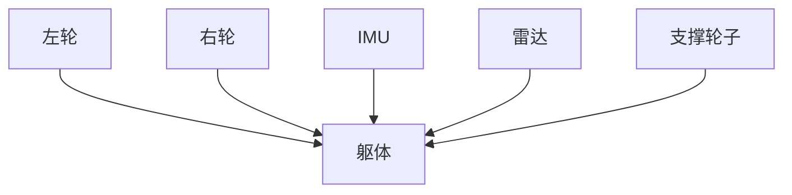
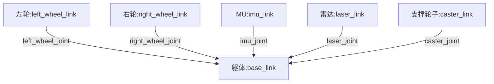
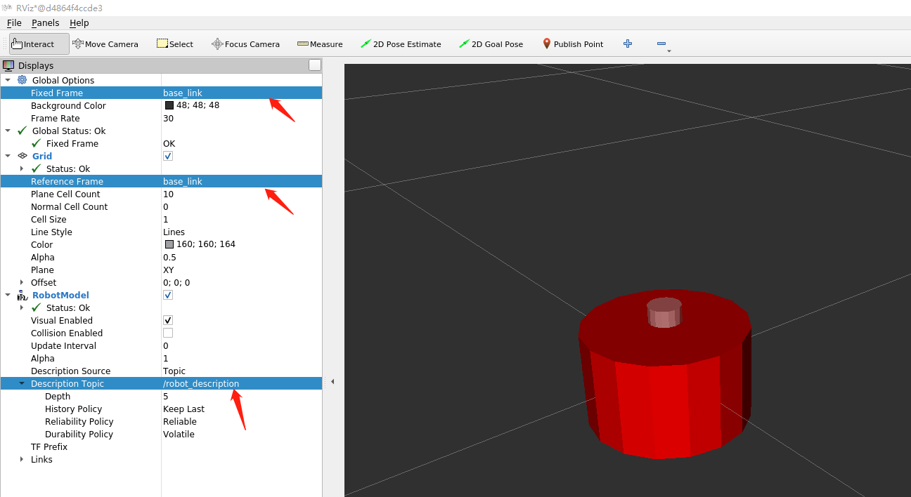

# 1. URDF统一机器人建模语言

大家好，我是小鱼，本节课我们来介绍机器人的URDF建模。

URDF（Unified Robot Description Format）统一机器人描述格式，URDF使用XML格式描述机器人文件。

> XML是 **被设计用来传输和存储数据的可扩展标记语言**，注意语言本身是没有含义的，只是规定了其数据格式
>
> 比如说下面这段信息：
>
> ```
> <robot name="阿童木">
> <link name="大手臂">具体的描述</link>
> <joint name="胳膊肘">具体的描述</joint>
> <link name="小手臂">具体的描述</link>
> </robot>
> ```
>
>
> XML格式在线校验工具:[在线代码格式化 (oschina.net)](https://tool.oschina.net/codeformat/xml)
>
> XML格式注释：<!-- 注释内容 -->
> 标签: `robot` `link`
>
> robot标签的属性`name`: `<robot name="fishbot"></robot>`
>
> robot标签的子标签`link`: `<robot name="fishbot"><link name="base_link"></link>link></robot>`


使用XML定义的一个最简单的URDF模型可以像下面这样

```xml
<?xml version="1.0"?>
<robot name="fishbot">
  <link name="base_link">
    <visual>
      <geometry>
        <cylinder length="0.18" radius="0.06"/>
      </geometry>
    </visual>
  </link>
</robot>
```


接着我们从下面四个方面介绍URDF：

1. URDF的组成介绍
2. URDF-Link介绍
3. URDF-Joint介绍
4. 创建一个简单的URDF并在RVIZ2中可视化


## 1.URDF的组成介绍

一般情况下，URDF由`声明信息`和`两种关键组件`共同组成

### 1.1 声明信息

声明信息包含两部分，第一部分是xml的声明信息，放在第一行
第二部分是机器人的声明，通过robot标签就可以声明一个机器人模型

```
<?xml version="1.0"?>
<robot name="fishbot">
 	<link></link>
 	<joint></joint>
  ......
</robot>
```

## 1.2 两种关键组件(Joint&Link)


以FishBot机器人为例分析。观察下图机器人的结构。


可以简化为如下五个部件组成：

- 躯体

- 左右轮子

- 支撑轮

- 雷达激光

- IMU模块

这五个部件之间的固定方式为：



我们把左轮，右轮、支撑轮子，IMU和雷达部件称为机器人的Link

**而Link和Link之间的连接部分称之为Joint关节**

接着我们给每个link和joint取个名字。



所以我们就可以使用6个link和5个joint来描述这个机器人，接着我们分别对link和joint进行详细的介绍。


## 2.Link介绍

上面我们介绍完了link，那一个link该怎么写呢？

我们来看一个base_link的写法，通过link标签即可声明一个link,属性name指定部件名字

```xml
  <link name="base_link">

  </link>
```

通过两行代码就可以定义好base_link，但现在的base_link是空的，我们还要声明我们的base_link长什么样，通过`visual`子标签就可以声明出来机器人的visual形状。

```xml
  <!-- base link -->
  <link name="base_link">
  	<visual>
      <origin xyz="0 0 0.0" rpy="0 0 0"/>
      <geometry>
		<cylinder length="0.12" radius="0.10"/>
      </geometry>
    </visual>
  </link>
```

### 2.1 link标签定义

link的子标签列表

- visual 显示形状
  - `<geometry> `(几何形状)
    - `<box>` 长方体
      - 标签属性: `size`-长宽高
      - 举例：`<box size="1 1 1" />`
    - `<cylinder>` 圆柱体
      - 标签属性:`radius` -半径 `length`-高度
      - 举例：`<cylinder radius="1" length="0.5"/>`
    - `sphere` 球体
      - 属性：`radius` -半径
      - 举例：`<sphere radius="0.015"/>`
    - `mesh` 第三方导出的模型文件
      - 属性：filename
      - 举例:` <mesh filename="package://robot_description/meshes/base_link.DAE"/>`
  - origin (可选：默认在物体几何中心)
    - 属性 `xyz`默认为零矢量 `rpy`弧度表示的翻滚、俯仰、偏航
    - 举例：`<origin xyz="0 0 0" rpy="0 0 0" />`
  - material 材质
    - 属性 `name` 名字
      - color 
        - 属性 `rgba` a代表透明度
        - 举例：`<material name="white"><color rgba="1.0 1.0 1.0 0.5" /> </material>`
- collision  碰撞属性，仿真章节中讲解
- inertial 惯性参数 质量等，仿真章节中讲解


## 3.Joint介绍

joint为机器人关节，机器人关节用于连接两个机器人部件，主要写明父子关系

- 父子之间的连接类型，包括是否固定的，可以旋转的等

- 父部件名字
- 子部件名字
- 父子之间相对位置
- 父子之间的旋转轴，绕哪个轴转


比如我们再建立一个雷达部件`laser_link`，然后将`laser_link`固定到`base_link`

```xml
<?xml version="1.0"?>
<robot name="fishbot">
    
  <!-- base link -->
  <link name="base_link">
  	<visual>
      <origin xyz="0 0 0.0" rpy="0 0 0"/>
      <geometry>
		<cylinder length="0.12" radius="0.10"/>
      </geometry>
    </visual>
  </link>
    
  <!-- laser link -->
  <link name="laser_link">
  	<visual>
      <origin xyz="0 0 0" rpy="0 0 0"/>
      <geometry>
		<cylinder length="0.02" radius="0.02"/>
      </geometry>
      <material name="black">
      	<color rgba="0.0 0.0 0.0 0.5" /> 
      </material>
    </visual>
  </link>
    
  <!-- laser joint -->
    <joint name="laser_joint" type="fixed">
        <parent link="base_link" />
        <child link="laser_link" />
        <origin xyz="0 0 0.075" />
    </joint>

</robot>
```

### 3.1 joint标签详解

#### joint属性

- name 关节的名称
- type 关节的类型
  - **revolute: 旋转关节，绕单轴旋转,角度有上下限,比如舵机0-180**
  - **continuous: 旋转关节，可以绕单轴无限旋转,比如自行车的前后轮**
  - **fixed: 固定关节，不允许运动的特殊关节**
  - prismatic: 滑动关节，沿某一轴线移动的关节，有位置极限
  - planer: 平面关节，允许在xyz，rxryrz六个方向运动
  - floating: 浮动关节，允许进行平移、旋转运动

#### joint的子标签

- `parent` 父link名称
  - ` <parent link="base_link" />`
- `child`子link名称
  - `<child link="laser_link" />`
- `origin` 父子之间的关系xyz rpy
  - ` <origin xyz="0 0 0.014" />`
- `axis` 围绕旋转的关节轴
  - `<axis xyz="0 0 1" />`


下一节我们尝试将我们的机器人模型在RVIZ2中显示出来




参考文档

- [urdf/XML/link - ROS Wiki](http://wiki.ros.org/urdf/XML/link)

- http://docs.ros.org/en/humble/Tutorials/URDF/URDF-Main.html

--------------

技术交流&&问题求助：

- **微信公众号及交流群：鱼香ROS**
- **小鱼微信：AiIotRobot**
- **QQ交流群：139707339**

- 版权保护：已加入“维权骑士”（rightknights.com）的版权保护计划